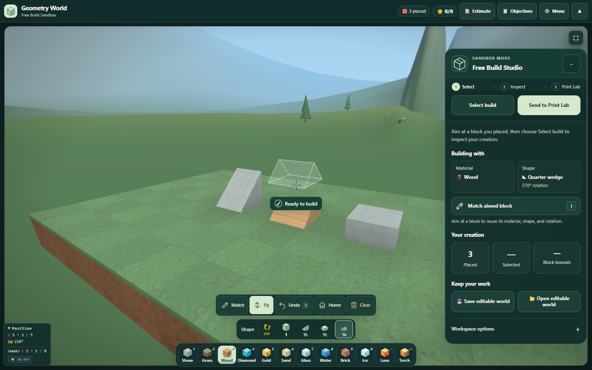
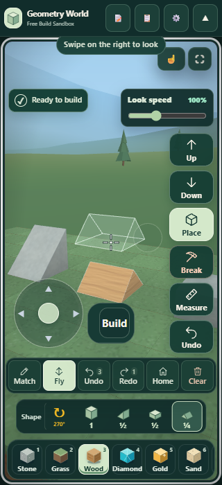
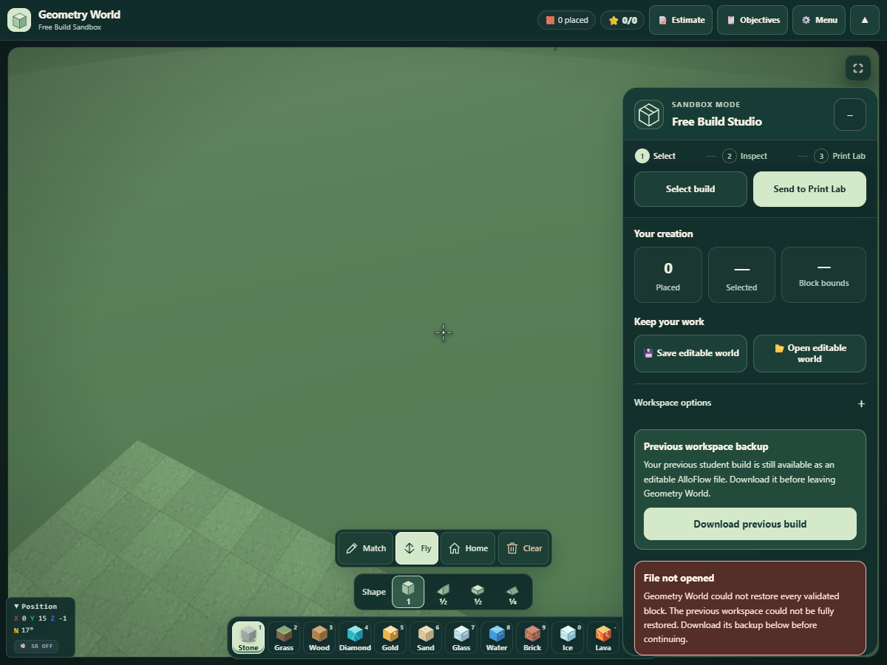

# Geometry World: building tools and import recovery

This pass improves everyday building: reuse an existing block in one action, see the current material and shape more clearly, and recover the previous workspace when opening a file fails.

## What changed

- **Match block:** aim at a block and use **I**, middle-click while the world has pointer lock, the Match toolbar button, or **Match aimed block** in the builder dock. It copies material, shape, and rotation together. The placement preview and immediate next placement use the copied recipe.
- **Clearer building panel:** current choices appear above creation statistics; long shape names wrap, with rotation on a separate line. The narrow phone toolbar keeps every utility label visible with targets at least 44 px, including when Redo appears. Showcase correctly says “1 block” for a single block.
- **Accurate break feedback:** protected ground and lesson blocks keep their protective response without reducing the placed count or triggering successful-break effects. Stale ray hits cannot remove a replacement block.
- **Checked import recovery:** validation still precedes confirmed replacement. If any placement returns a rejection, throws, or does not create the expected block, Geometry World attempts a checked restoration of the previous live blocks and their roles, history, selection, counters, camera, lesson state, and print context.
- **Recovery after a second failure:** if restoration also fails, the first complete backup remains available. A valid student build can be downloaded as editable AlloFlow JSON; an empty or oversized original instead offers clearly labelled recovery details. Failed imports from Showcase return to the building dock with a focused explanation.

## Verification

**303 unique tests passed across 10 suites.** Each recorded Vitest process exited 0; loaded case counts match its JSON output. Coverage includes all 192 material/shape/rotation recipes, immediate I → B placement, keyboard and modal guards, feedback timer ownership, protected and stale removal, placement previews, editable files, and the existing Print Lab geometry/continuity workflow.

The final source snapshots passed browser checks at 1440×900, 390×844, 320×700, and 844×390. Every utility action is reachable and at least 44 px, including six actions with Redo at 320 px. Match feedback stays within the screen and clears the other controls. Native touch, Space, I, and middle-click with genuine browser pointer lock all work. Matching leaves geometry, STL, history, selection, counters, and camera unchanged; immediate I → B creates the expected rotated quarter wedge.

The protected-ground regression is demonstrated in the browser: the previous version changed the placed count from **3 to 2**; the updated version keeps it at **4**.

Actual-browser import fault injection covers a null placement, a thrown placement, a failed import from Showcase, and a persistent placement failure that prevents restoration. Ordinary failures restore the checked workspace exactly. The persistent-failure recovery JSON was downloaded through the UI and reopened successfully with the original editable geometry and identical STL.

Canonical and desktop scripts parse and match byte for byte. Both browser runs used these final hashes. Print Lab source is unchanged. No page, console, or shader errors were observed.

## Practical limits

These checks use local production scripts in a minimal React/THREE host and software WebGL. Ray targets are controlled on real meshes for repeatable interaction checks. They do not establish hardware GPU performance or a physical printing result. Normal in-app rollback preserves print context and lesson roles; the downloadable editable recovery file preserves the student build under the existing JSON format. It is a recovery option while Geometry World remains open, not an autosave service.

## Evidence

- [Machine-readable summary](summary.json)
- [Final building browser checks](after-results.json)
- [Import recovery browser checks](import-browser-results.json)
- [Focused Match test report](BUILDING-TOOLS-TESTS.md)
- [Recovered editable build](recovered-previous-build.json)

- stem_tool_geometryworld.js: `d404aa8eb50229a15cd1b847413896376c694196f4cf59be7c7ff1958dab263a`
- stem_tool_geometryworld_builder.js: `a6fa9937733393863977912c02e240dd7101bf2f6c8f8d61e6af8c102653cec2`
- stem_tool_printlab.js: `f4629f78eea79605739fa4793d1bda36877a7b3cd848be89b3bc136e4651f742`
