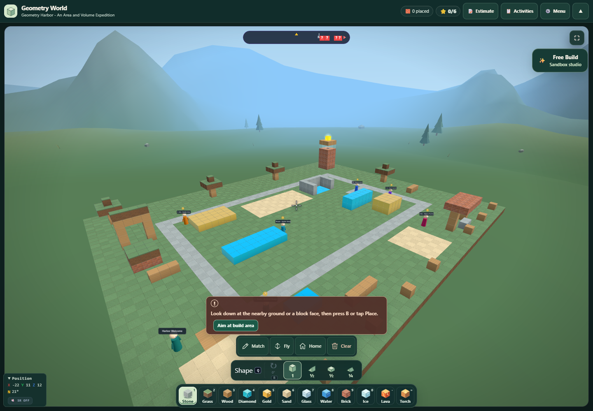

# Geometry World: richer lessons and larger worlds

Implemented locally on September 12, 2026. Canonical modules and their desktop public copies are synchronized. These changes have not been committed or deployed by this task.

**Geometry Harbor** is an original connected lesson with six activities, seven NPCs, and nineteen question steps. Its arrival practice area, area/perimeter gardens, reservoir, equal-volume models, and makers pavilion give students a sequence of building, measuring, explaining, and revising. A pale loop path, sand construction plots, trellis, trees, benches, and lighthouse make the stations recognizable. No Minecraft world assets were copied into the app.

Open **Geometry World → Learn → Choose a lesson → Geometry Harbor**. The **Activities** button opens an exploration journal with activity selection, hints, criteria, reflection notes, and safe travel to each station. Review marks are explicitly student self-checks and do not change the question score. Notes persist in the app's saved tool data and can be downloaded as JSON.

**Generated lessons now have a depth and estimated-length slider.** The default is Guided. Existing settings using the older pass-count field migrate to the corresponding depth until the user chooses a new value.

| Setting | Activities | Estimated student time | Main generation stages | Maximum calls including repairs |
| --- | ---: | --- | --- | ---: |
| Quick | 2 | 10–15 minutes | Plan, create world | 3 |
| Guided | 4 | 25–35 minutes | Plan, create world, review | 5 |
| Expedition | 5 | 45–60 minutes | Plan, create world, enrich mentors, review | 6 |

These are student-time estimates, not generation-time promises. Longer settings add connected construction tasks, worked examples, hints, reflections, follow-up questions, and a final design challenge. Generation continues through the app's existing AI request pathway.

The generator checks required activities and mentors, referenced structures, coordinate bounds, clear arrival positions, overlapping fills, and construction budgets. Supported numeric measurement metadata is recomputed from the actual inclusive prism dimensions. Failed checks request a complete repair within a bounded call allowance; an invalid result does not replace the current world. Cancellation, tool unmount, replacement requests, and world changes prevent stale responses from being applied. A request already sent can still complete at its provider after cancellation.

Authored generated structures have budgets of 450, 700, or 900 blocks. Ground is separate, leaving at least 600 construction slots for student work at Expedition depth. Generated content still benefits from educator review: automatic checks establish structural consistency and supported numeric answers, not the educational quality or correctness of every possible claim.

**Terrain now uses instanced chunks while preserving the block identities used by collision, placement, measurement, and recovery.** Ground supports up to 16,384 cells independently of the 1,500 construction-block limit. Existing flat paths become visible floor overlays. Harbor loads all 2,365 ground cells and 308 teaching/scenery blocks without truncation, leaving 1,192 construction slots. Student import and Print Lab return capacities use the same construction budget; return notices account for omitted valid blocks.

Real browser testing found and fixed two terrain color requirements in the installed Three.js r128 renderer: neutral base vertex colors and allocating the entire instance-color buffer before reducing the visible instance count. The final screenshots and GPU readback confirm colored terrain. Browser testing also found and fixed generation parser scope and React hook ordering during loading.

**Verification completed:**

- All 1,026 tests across 54 Geometry World suites passed. The three generation suites then passed all 40 checks again after removing temporary patch dependencies from their fixtures.
- 67 real-browser Harbor checks passed: native entry, all six travel points, geometry measurements, journal save/export, keyboard focus, and 390/320-pixel and landscape layouts.
- 20 real-browser generation checks passed: keyboard slider controls, responsive layout, cancellation and stale results, intentional wrong-answer repair, final review, save, and world loading. These used deterministic AI responses with the real UI, request orchestration, and engine; no live paid model generation was performed.
- 10 native Print Lab round-trip and re-entry checks passed, preserving geometry, selection, undo/redo history, and print scale.
- Four final gallery checks passed with no browser errors. Ground ray tests also compared 500 randomized rays against ordinary Three.js mesh raycasts.

Final visual evidence: [overview](harbor-overview-final.png), [gardens](harbor-gardens-final.png), [reservoir](harbor-reservoir-final.png), [phone activity guide](harbor-guide-320x700.png), and [phone depth control](generation-depth-390.png). The generation-control screenshot predates the final terrain color fix; use the three final Harbor views to assess terrain appearance.

Machine-readable evidence: `geometry-regressions-final.json`, `expedition-ui-browser.json`, `generation-browser.json`, `returning-browser.json`, `harbor-gallery-browser.json`, and `ground-webgl-debug.json`.

Primary implementation files are `stem_lab/stem_tool_geometryworld.js` and `stem_lab/stem_tool_geometryworld_builder.js`, mirrored under `desktop/web-app/public/stem_lab/`. Prepared integration scripts in this report folder are historical one-time patches; production already contains their changes.
