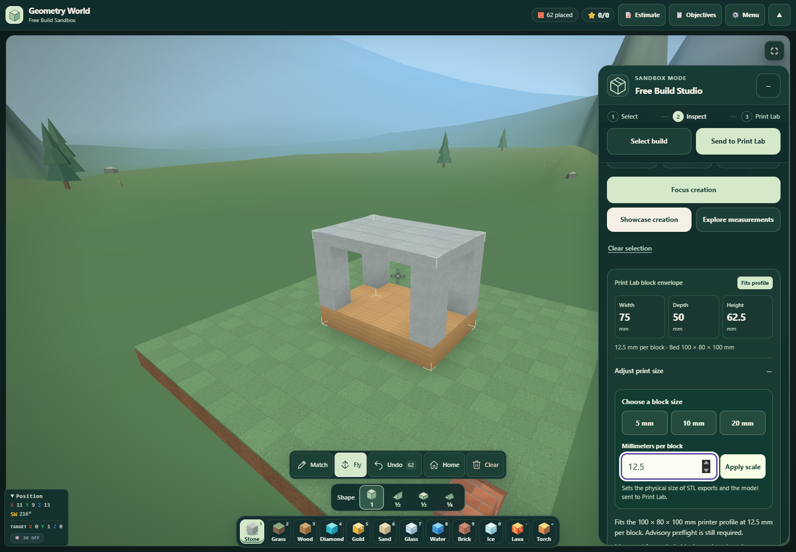
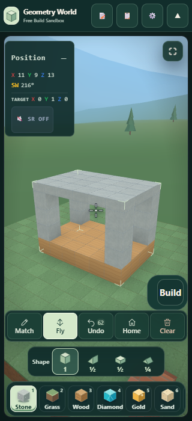

# Geometry World: print sizing and a clearer small-screen inspector

You can now choose physical print size inside Geometry World, with presets and a custom millimeters-per-block value. The selected build's dimensions and printer-fit guidance update immediately, and Showcase STL export and Print Lab use that same scale.

## Improvements

- **Adjust print size:** open the disclosure under the selected creation's dimensions. Choose 5, 10, or 20 mm per block, or apply a custom value from 0.01 to 1,000. The form keeps unfinished edits separate from the saved scale and explains invalid entries without changing the committed value.
- **Stable editing:** switching between oversized and fitting scales keeps the open editor and keyboard focus in place. Explicitly closing it remains your choice. Incoming scale changes, including a return from Print Lab, synchronize the displayed value.
- **Consistent outputs:** changing scale preserves block geometry, selection, undo history and existing print context. It updates physical dimensions and fit guidance; the existing STL exporter scales a copy and the Print Lab handoff carries the chosen value.
- **Readable controls:** the Apply button retains contrast while hovered, and each scale control has a minimum 44 px target. The Showcase file caption also uses “1 block” for a single selected block.
- **Small-screen Position panel:** pointer and keyboard users can now read the disclosure below the game bar. Its summary and announcement toggle have 44 px targets, and the expanded panel is bounded so it can scroll independently. Collapsed game-bar and fullscreen layouts are covered.

## Verification

**152 tests passed across 6 suites**, with every recorded Vitest process exiting 0. The new scale suite covers validation, live preset/custom changes, AI/context preservation, disclosure state and focus, and unchanged source geometry/history. Existing regression checks cover print presentation, the build-to-print workflow, Showcase files, import recovery, and Match block.

The final browser run exercised the editor at 1440×1000, 390×844, 320×700 and 844×390, including every preset and custom Apply at each size. Hovered Apply text meets a 4.5:1 contrast threshold. Position controls were checked with the game bar shown/collapsed and the panel open/closed, plus native fullscreen. No page, console or shader errors were observed.

A pavilion containing **60 selected blocks** was tested alongside **two unselected blocks**. Its whole-block envelope at 12.5 mm per block is **75 × 50 × 62.5 mm**. The downloaded selected STL measures **75 × 50 × 56.25 mm**, correctly reflecting the half-height roof. This preserves the existing distinction between the conservative block envelope and exact mesh dimensions. Print Lab's Revise action returned the entire workspace, including the unselected blocks, at the chosen 12.5 mm scale.

Canonical source and desktop mirrors parse and match byte for byte. Browser snapshots match the final sources; Print Lab source is unchanged. These are local software-WebGL and file-workflow checks, not a physical printing result or hardware performance measurement.

## Evidence

- [Machine-readable summary](summary.json)
- [Final browser run](after-browser.json)
- [Baseline browser run](before-browser.json)
- [Scale controls test report](SCALE-CONTROLS-TESTS.md)
- [Position HUD review](POSITION-HUD-REVIEW.md)
- [Exported pavilion STL](pavilion-12.5mm.stl)

- stem_tool_geometryworld.js: `a2127e6b153534bbcde4220acf14891d843f541d51c4e8c1369d258758ad5574`
- stem_tool_geometryworld_builder.js: `aef23025eabb67ad00852a9b7fc44d130e3fdade398456e2cc6219f5d0932371`
- stem_tool_printlab.js: `f4629f78eea79605739fa4793d1bda36877a7b3cd848be89b3bc136e4651f742`
