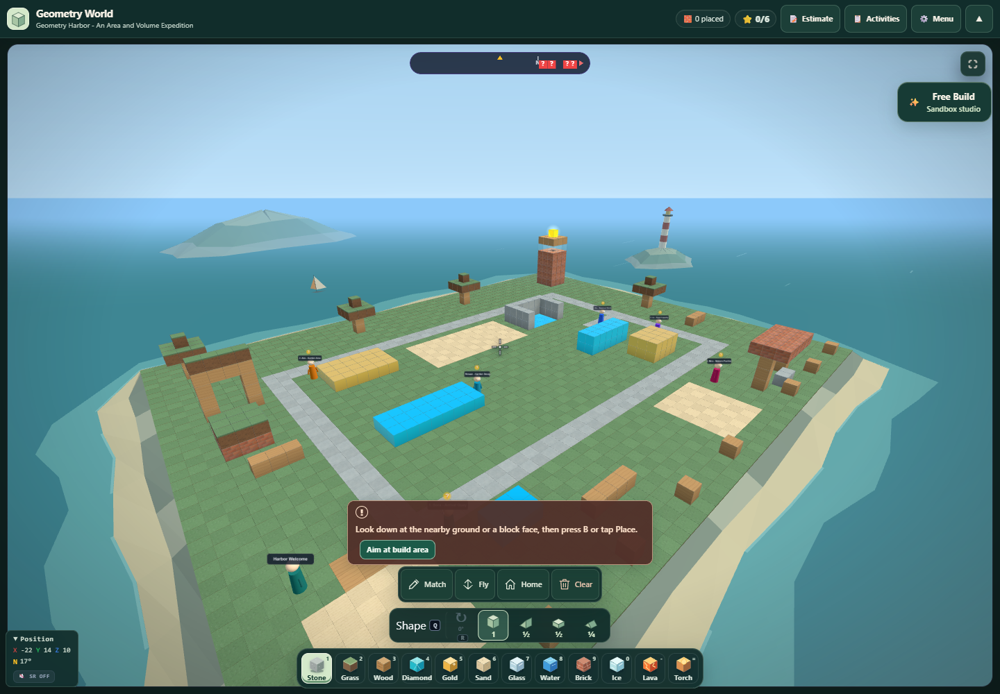
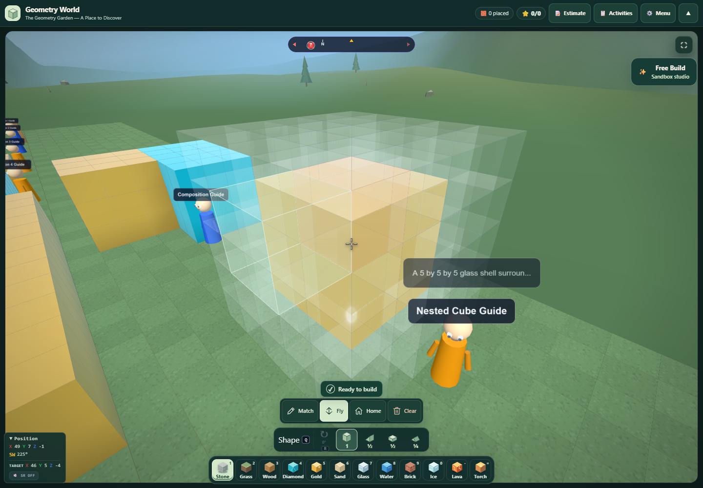

# Geometry World refinement — September 12, 2026

This pass adds a coastal Harbor setting, clearer lesson previews and activity navigation, and a corrected eight-stop Geometry Garden. Changes are local; this task has not committed or deployed them.

**Harbor now sits on a coastal island.** Calm sea, a rocky and sandy shore, distant islands, a separate offshore beacon, and small sailboats establish the setting. The scenery uses six merged decorative meshes, supports the existing quality tiers, and remains static under all motion settings. It does not enter the construction map, collision, measurements, selection, or STL exports. Showcase hides and restores it through the existing landscape lifecycle.

**Lesson previews explain the world before entry.** Learn and Explore show actual activity and question-step counts, estimated student time when provided, and a bounded overhead SVG preview with teaching footprints and numbered activity locations. Dotted connections show activity order. Legacy lessons use guide locations; missing or malformed optional metadata does not prevent entry.

The activity journal retains its selector and adds Previous/Next buttons, a clear activity counter, and an optional route overview. Browsing focuses the new activity heading while preserving the camera, blocks, question score, and review state. Travel remains an explicit separate action. First/last buttons disable at the appropriate boundaries, and controls remain usable on narrow phones and landscape screens.

**The Garden now supports eight optional, ungraded discoveries.** Guides and arrival points stand in reachable clear areas. A stone path continues around the wall to the hidden monument, and the enlarged ground supports its entire footprint. Several models were separated from neighboring models or scenery so the Measure tool reports the intended solid.

| Garden model | Verified occupied volume |
| --- | ---: |
| Unit cube | 1 |
| Five-cube row | 5 |
| One-layer area model | 15 |
| Three-layer prism | 45 |
| Three differently shaped gold models | 24 each |
| Two-part L model | 72 |
| Nested glass/gold model | 125 total: 98 glass + 27 gold |
| Hidden stepped monument | 85 |

The nested model previously filled all 125 positions with glass, preventing the inner gold from being placed. It now constructs an actual glass shell and gold center. The activity explains that Measure counts the touching materials together and distinguishes that combined value from shell-only volume.

**The shipping lesson now checks physical fit.** Its 6×2×3 interior can hold three axis-aligned 2×2×2 boxes, leaving 12 cubic units. The lesson no longer suggests that a volume quotient proves four boxes fit. A brute-force placement test checks the maximum, and the spawn and guide positions were moved to clear ground.

Generated lessons can request `landscapeTheme: "coastal"` when their topic or setting calls for it. Meadow remains the default, missing legacy metadata remains valid, and unsupported values request repair through the existing validation flow. This adds no generation calls. Live paid model responses were not requested in this pass.

Browser verification passed 68 preview/navigation checks, 22 Garden checks, and three coastal checks with no page or console errors. Garden's actual loaded world has 1,891 ground cells and 470 teaching/scenery blocks; Harbor retains its full 2,673 cells and its original teaching measurements.

Further visual evidence: [Harbor preview](harbor-preview-1440x1000.png), [phone preview](harbor-preview-320x700.png), [phone journal](journal-navigation-390x844.png), [hidden monument](garden-hidden-monument-final.png), and [Garden overview](garden-discovery-overview-final.png). Some navigation captures precede the final coastal metadata and the wording change from “Your route” to “Activity locations”; their tested controls and layout are unchanged.

Machine-readable evidence is in `navigation-browser.json`, `garden-browser.json`, `coastal-browser.json`, and `all-geometry-tests.json`. Tests read the production modules directly. Prepared patch scripts in this folder are historical integration artifacts and should not be reapplied to the current source.

Canonical modules are `stem_lab/stem_tool_geometryworld.js` and `stem_lab/stem_tool_geometryworld_builder.js`, mirrored under `desktop/web-app/public/stem_lab/`.

Final regression result: **1063 tests passed across 58 Geometry World suites; zero failures.** Source syntax, mirror equality, and patch whitespace checks also passed.
