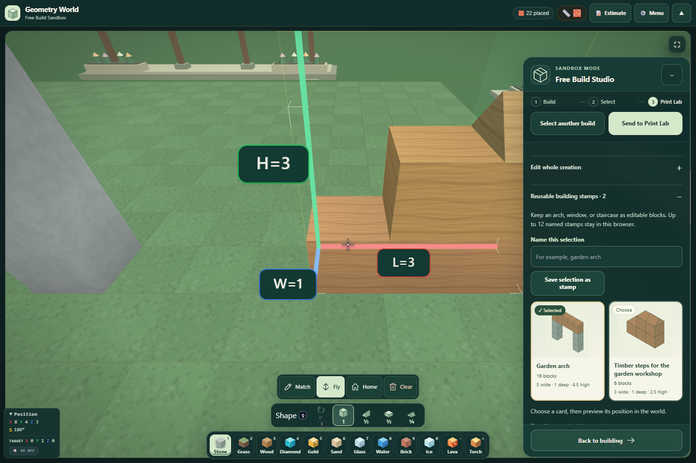
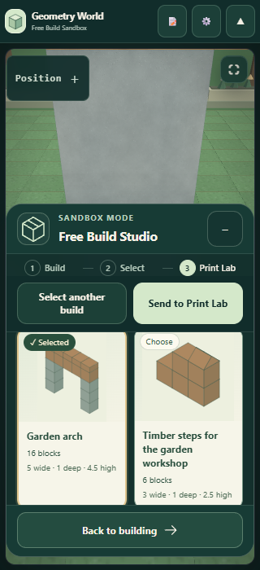
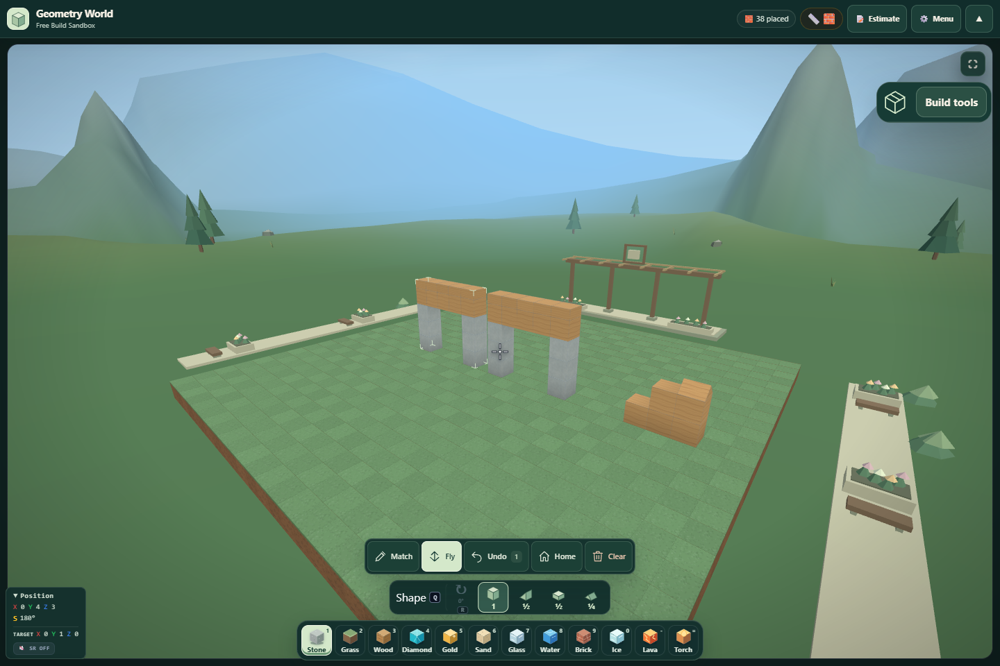

# Geometry World: visual stamps and easier copies

The stamp library now presents saved creations as illustrated cards, and Duplicate suggests an adjacent position that has room for the whole selection. Canonical and desktop builder files are synchronized. These are local changes; no commit or deployment was performed.

## Visual stamp library

Open **Build tools → Reusable building stamps**. Each card shows the saved material colors, supported shapes and rotations, block count, and physical width, depth, and height. Fractional shapes retain fractional heights in their descriptions. The selected card has a text badge and a border, and native buttons support keyboard selection.

Choosing a card changes the recipe used by **Preview stamp**. It does not place geometry or change the current world selection. Choosing another card, or saving a different stamp, cancels an earlier placement preview so Apply cannot silently place the previous recipe.

Illustrations reuse the existing local SVG geometry renderer. They are computed only while the library is open and are memoized until its contents change. No image generation, network request, or additional WebGL renderer is needed. Existing storage bounds and stamp recipes remain unchanged.

## Clear-position copy suggestions

Choose **Edit whole creation → Duplicate**. The suggested offset uses the entire selection's grid footprint. It tries the two X sides, then the two Z sides, then the next grid layer above, stopping at the first valid position. Side copies leave one empty grid cell between their bounding boxes.

**Beside X**, **Beside Z**, and **Stack above** provide direct placement previews. Numeric offsets remain available. Every candidate uses the existing bounds, collision, capacity, and protected-geometry validation. No position is committed automatically. Apply rechecks the source and destination; a completed copy is one Undo/Redo operation.

The search is deliberately bounded to adjacent positions. If these are unavailable, the UI explains that another direction or a manual offset is needed. Stacking uses the next integer grid layer; fractional blocks can still leave physical gaps that should be reviewed before printing.

## Verification

- **123 tests passed** across selection editing, mounted editor UI, builder navigation, and drawing navigation. See `tests.json`.
- **22 WebGL browser checks passed** for real thumbnails, saved dimensions, card selection, stale-preview cancellation, stamp placement, clear-side duplication, single-step Undo/Redo, and 390/320-pixel layouts. See `browser.json`.
- **3 final browser checks passed** for the corrected high-contrast badges and keyboard Space selection. See `contrast.json`.
- No page runtime errors in either browser run. JavaScript syntax, desktop byte parity, and scoped whitespace checks passed.
- Browser screenshots were inspected at desktop and 320-pixel phone width. The high-contrast badge issue found during verification was corrected and rechecked.

## Screenshots

Browser checks use the local React/Three host with Chromium SwiftShader and explicit geometry fixtures. They do not verify the deployed Gemini Canvas host or a physical printer.
