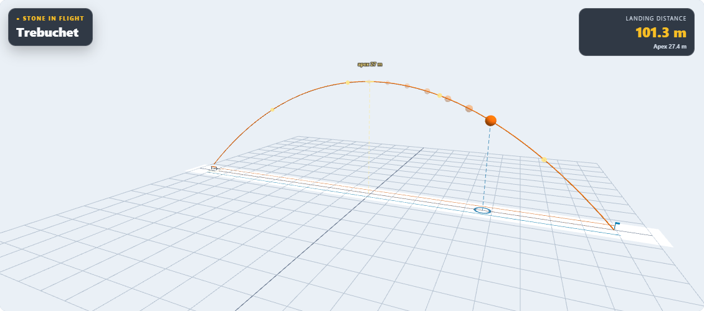
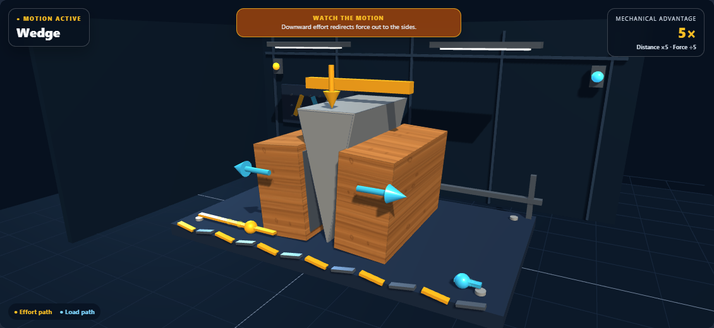
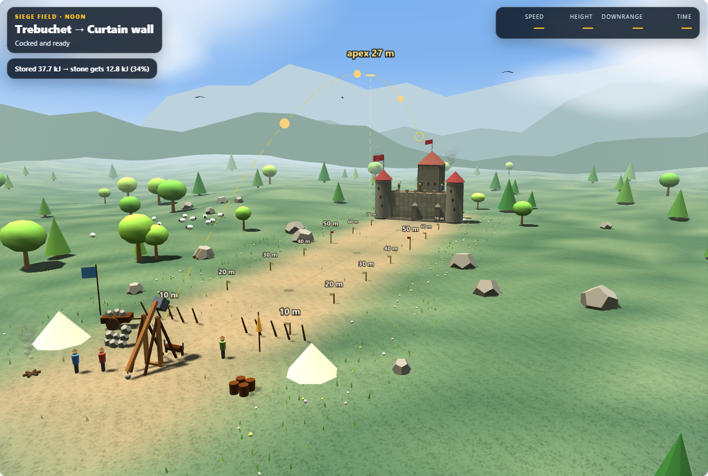

# Machine Lab: second visual pass

## Changes

- Test Range: timestamp-based playback now handles uneven sample spacing and a clock starting at zero. Older paths without timestamps retain their playback fallback.
- A fading, equal-time trail makes speed changes visible. The stone keeps a stable size; a blue ground ring and vertical guide reveal height and crosswind drift.
- The new instruments remain hidden until a valid shot is revealed. Reduced motion shows a stable sequence of positions across the complete flight.
- A side-oriented default camera makes the arc easier to read. New sessions and the reset button share the same defaults; saved custom camera positions remain respected.
- Phone layout moves the HUD above the scene, keeps the legend below it, and uses a shorter canvas. Removing atmospheric fog from this measuring bay fixes the nearly invisible trajectory at portrait camera distances.
- Ramp effort arrows point along the incline and follow the load. Wedge load arrows point outward and follow the splitting blocks.
- Siege Field terrain uses subdued meadow greens and warmer earth, keeping the firing lane distinct.

## Verification

**305/305 affected tests passed** across geometry, scene, camera, view, and translation hygiene suites. Eight new behavior tests cover timing, trails, ground projection, prediction gating, reduced motion, legacy paths, and force directions.

Real Chromium checks verified light and high-contrast range states, moving ramp and wedge scenes, the field palette, and an actual Run button cycle. The new range layout was visually inspected at 320px and 390px: no horizontal overflow, visible trajectory, and an accessible explanation of the guide. No browser errors were reported. Source syntax and whitespace checks pass, and the desktop source mirror is identical.

## Screenshots

[320px phone view](pass2-interaction/range-320.png) · [390px phone view](pass2-interaction/range-390.png) · [Ramp in motion](pass2-light/motion-ramp-detail.png)

[First visual pass](review.md) · [Machine-readable verification](pass2-summary.json)
