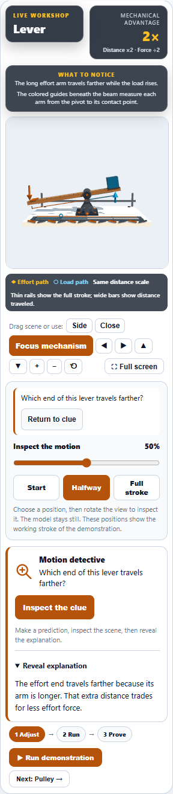
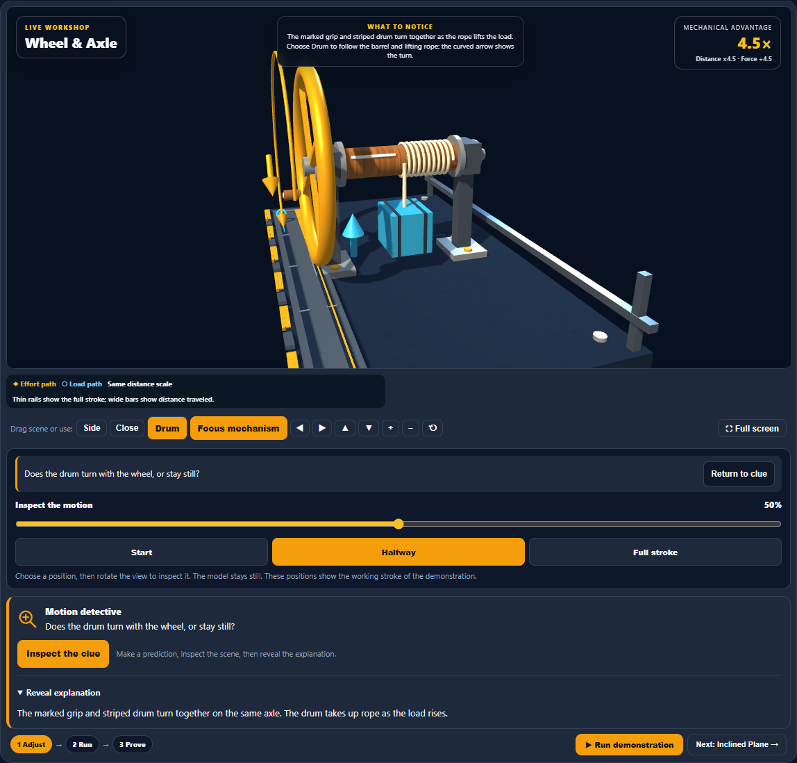
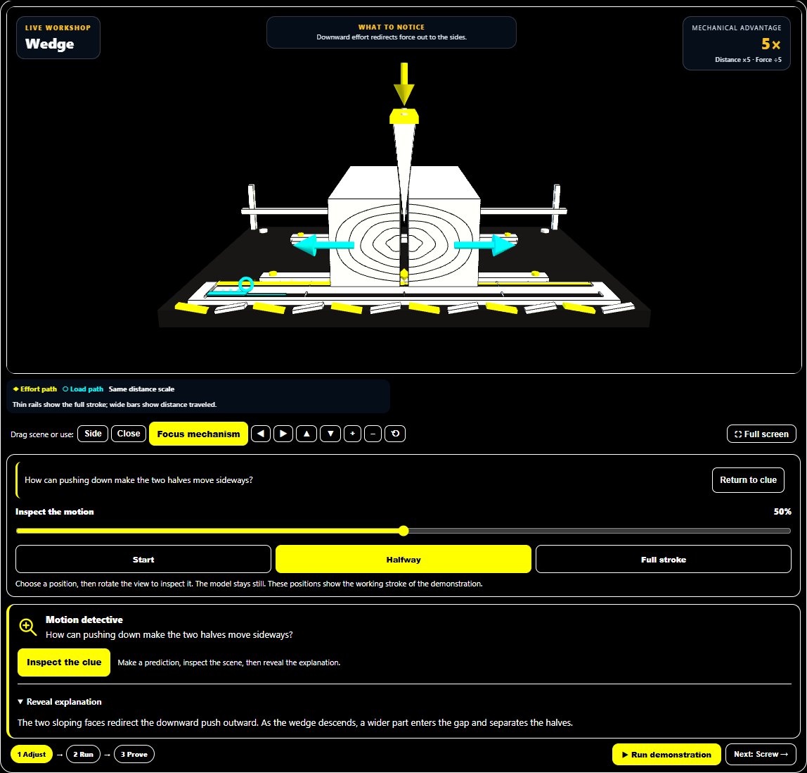

# Machine Lab: clue inspection and return

Observation questions now stay visible above the motion slider while learners inspect a mechanism. A compact Return to clue button returns keyboard focus to the explanation disclosure without opening it automatically. Station changes clear the reminder.

Inspect the clue pauses a running demonstration and focuses the newly enabled slider after the state update. Short phone screens scroll enough to keep that focused control visible. The existing held pose, camera framing, and explanation state remain consistent through the round trip.

## Validation

- 213 focused tests passed across four files, including 26 added reminder and station-state cases.
- Light, dark, and high-contrast browser runs each passed nine desktop scenarios, twelve mobile station checks, a short-phone focus check, playback takeover, reduced motion, stale-timer isolation, and station reset.
- No browser errors or horizontal overflow were detected.
- Source and desktop mirror are byte-identical; both production source and browser harness parse successfully.
- Visually reviewed the light mobile lever, dark desktop windlass, and high-contrast desktop wedge captures.

## Screenshots

Changes remain local. No commit, push, or deployment was performed.
