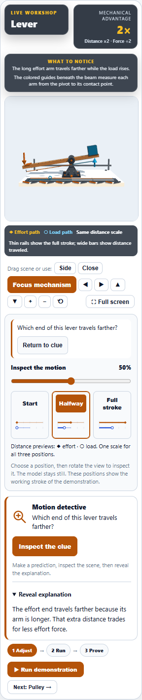
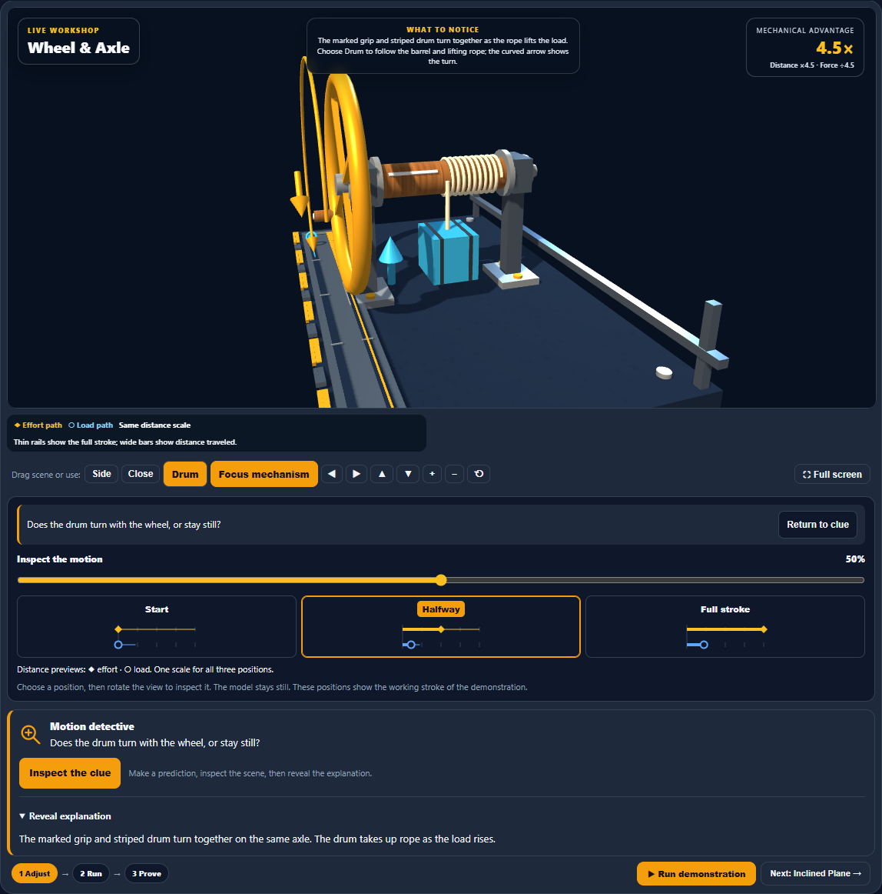
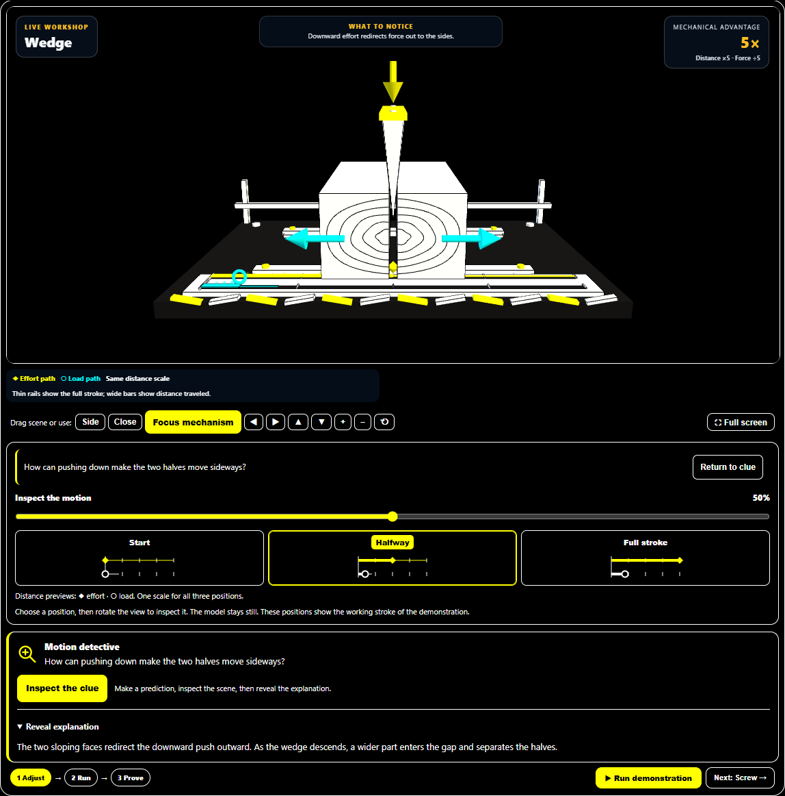

# Machine Lab: visual stroke previews

Start, Halfway, and Full stroke now show miniature distance diagrams. Effort uses a solid diamond and load uses an open ring, matching the scene's shape legend. Thin rails show the complete stroke; thicker bars show distance traveled at each position. All three previews share a scale and preserve the configured mechanical-advantage ratio, including equal and reversed lever arms.

The selected card has an accent border and highlighted label. The diagrams stay aligned when labels wrap on narrow phones. Native buttons retain their existing accessible names and pressed states; a visible description explains the previews, and decorative SVGs stay out of keyboard navigation.

## Validation

- 224 focused tests passed across four files, including 11 added preview cases.
- After the final layout adjustment, light, dark, and high-contrast browser runs each passed nine desktop scenarios and twelve mobile station checks, plus short-phone focus, playback takeover, reduced motion, stale-timer isolation, and station reset.
- Browser checks compare every preview against the actual 3D effort and load distances and verify row alignment. No browser errors or horizontal overflow were detected.
- Independent measurements on a 320-pixel-wide viewport place corresponding markers within 0.01 pixels vertically across the three cards.
- Source and desktop mirror are byte-identical; production source and browser harness parse successfully.
- Visually reviewed light desktop and mobile views, dark windlass, and high-contrast wedge.

## Screenshots

Changes remain local. No commit, push, or deployment was performed.
