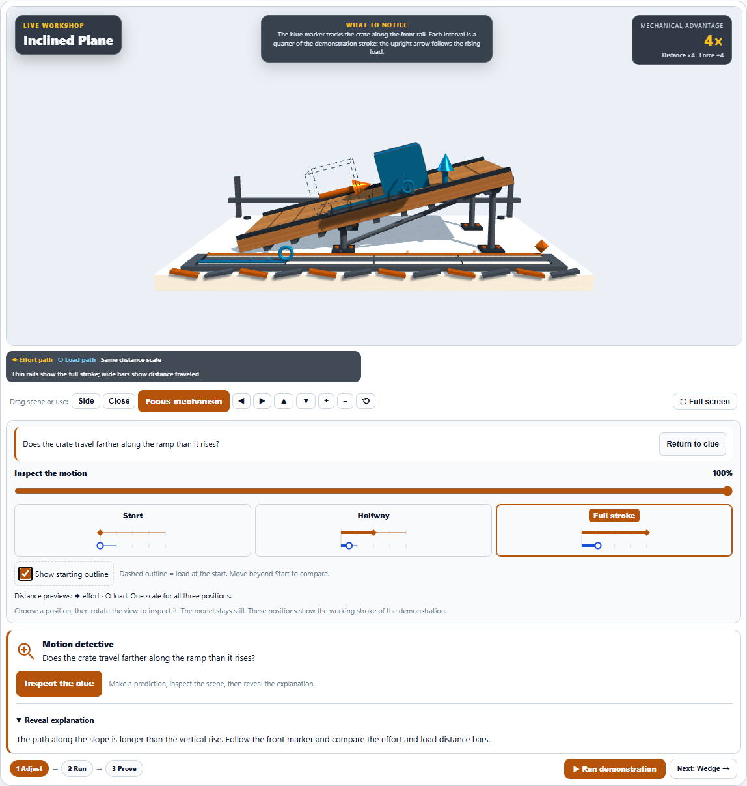
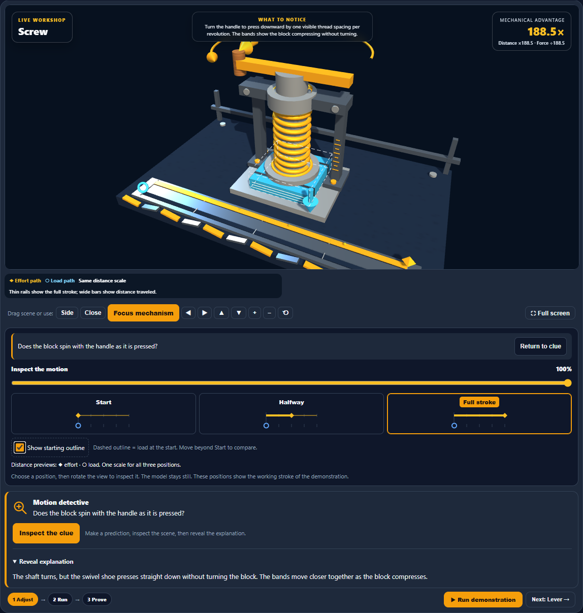
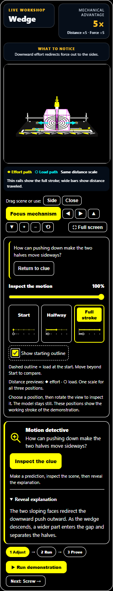

# Machine Lab: compare motion with the starting position

An optional Show starting outline checkbox adds a fixed dashed reference for the load in each of the six stations. The outline retains the initial shape and angle, including the lever's tilted load, the inclined crate, both timber halves, and the uncompressed press block. It remains fixed during inspection and playback, hides at Start, and can be toggled without rebuilding the scene.

The reference uses neutral ink in light and dark themes and magenta in high contrast. Dashed edges distinguish it from the solid moving load. A visible explanation identifies it as the load at the start.

Short-phone testing also exposed playback beginning while the scene was offscreen. Run now scrolls the bay into view and moves keyboard focus to it so the demonstration is visible immediately. The scene is programmatically focusable without adding another Tab stop.

## Validation

- 491 unique focused tests passed across five files: 259 geometry checks and 232 view, camera, accessibility, and localization checks. The 232 UI checks passed again after the playback focus adjustment. Nineteen cases were added for this pass.
- Final light, dark, and high-contrast browser runs each passed nine desktop scenarios and twelve mobile station scenarios, plus short-phone focus, visible playback, inspection takeover, reduced motion, stale-timer isolation, and station reset.
- Browser checks exercise the checkbox with Space, verify fixed outline geometry while scrubbing, preserve model identity, hide references at Start, and check the scene is focused and visible during playback on a 320 by 740 viewport.
- Final runs reported no browser errors or horizontal overflow. Earlier exploratory runs timed out during short-phone inspection and offscreen playback; all final checks passed after the playback adjustment.
- Source and desktop mirror are byte-identical. Production source and the browser harness parse successfully.
- Visually reviewed the light ramp, dark screw press, and high-contrast mobile wedge.

## Screenshots

Changes remain local. No commit, push, or deployment was performed.
