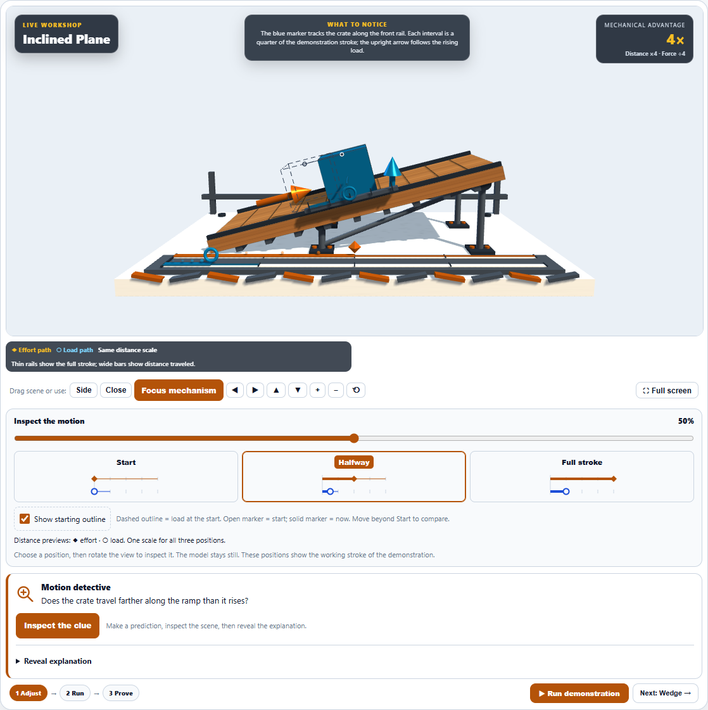
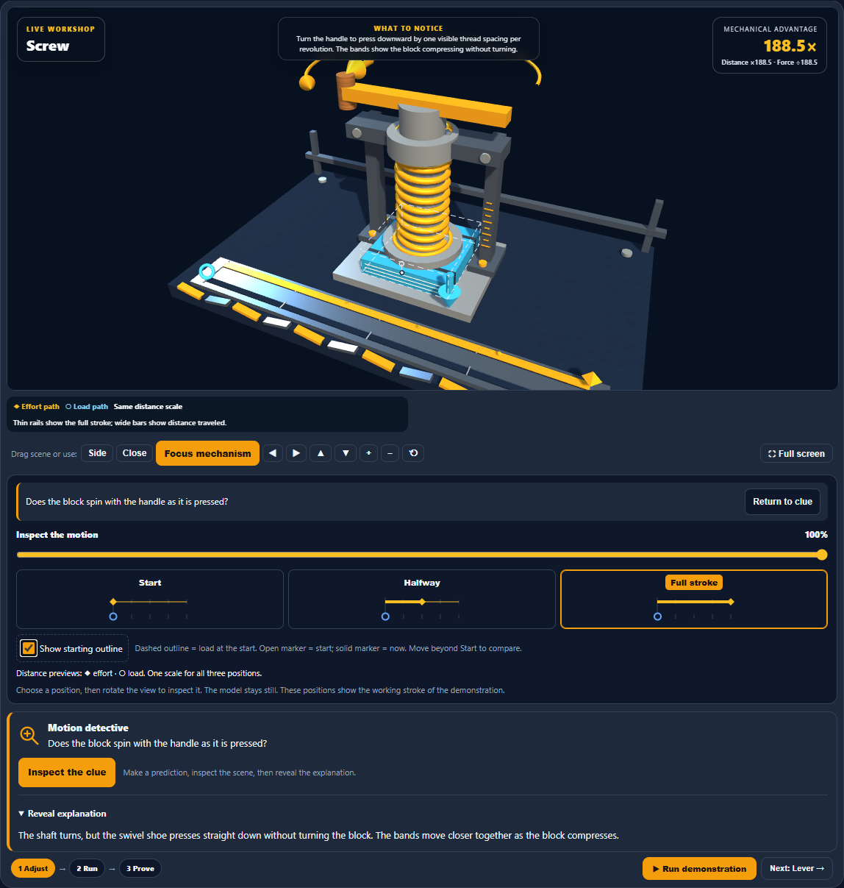
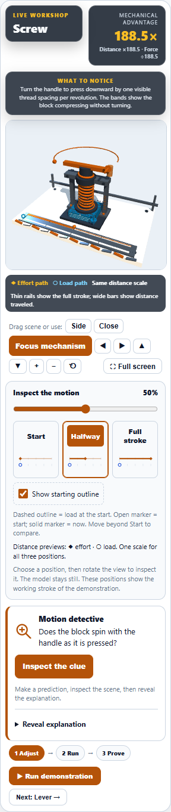

# Machine Lab: matching-point comparison markers

Show starting outline now includes an open marker at the original load position, a solid marker at its current position, and a straight connecting line. The markers follow the same front-top point through rotation, lifting, sliding, splitting, and compression. Both wedge halves have a reference. A contrasting rim keeps the moving dot visible on the colored load.

The reference stays fixed, disappears with the outline at Start, and uses the existing checkbox. The straight links compare positions; they do not represent an additional force or a curved travel path. Existing geometry is reused as the markers move.

## Validation

- 502 focused tests passed across five files, including 11 added geometry cases. All 270 geometry tests passed again after the final marker-rim adjustment.
- Light, dark, and high-contrast browser checks passed nine desktop scenarios and eighteen checks per theme, including twelve mobile cases, keyboard interaction, short-phone playback focus, reduced motion, and station reset. Dark and high-contrast runs include the final rim adjustment.
- After a shell approval-service timeout delayed the full light rerun, a focused final check passed for the light-theme ramp and screw at desktop and 320-pixel widths. This verified the white marker rim and generated four final screenshots.
- No browser errors or horizontal overflow were found in completed checks.
- Source and desktop mirror are byte-identical; production source and both review harnesses parse successfully.
- Visually reviewed the light ramp comparison, final dark screw-press markers, and final light mobile screw.

## Screenshots

Changes remain local. No commit, push, or deployment was performed.
