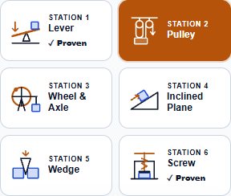
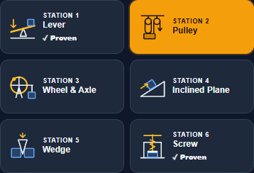
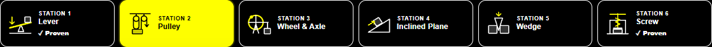

# Machine Lab: illustrated station chooser

Each station now has a small schematic showing its recognizable machine structure. The previews replace the chooser's emoji icons, preserve the selected-card highlight, and remain crisp in light, dark, and high-contrast themes. Completed stations explicitly say Proven alongside the check mark, making completion available visually and to screen readers.

The chooser now has one Tab stop. Left and Right arrows switch stations and wrap at the ends; Home and End select the first and last station. Selecting the already-active station with Home or End leaves the current investigation intact. Tab moves into the workshop controls and Shift+Tab returns to the selected station. Each tab identifies the workshop panel, which is labelled by the selected station.

## Validation

- 242 focused tests passed across four files, including 10 added cases for schematic previews, selected state, completion text, and panel relationships.
- Final browser checks passed at 1150, 390, and 320 pixels in light, dark, and high-contrast themes.
- Exercised all six stations by keyboard, reverse wrap, Home/End, active-station no-op, Tab exit/reentry, and pointer selection.
- Verified station changes stop playback, clear the previous clue and held stroke, retain starting-outline and focus preferences, and render the selected 3D machine.
- No browser errors or horizontal overflow. Source and desktop mirror are byte-identical; source and review harness parse successfully; git diff whitespace checks passed.
- Visually reviewed light phone, dark phone, and high-contrast desktop layouts.

## Screenshots

Changes remain local. No commit, push, or deployment was performed.
