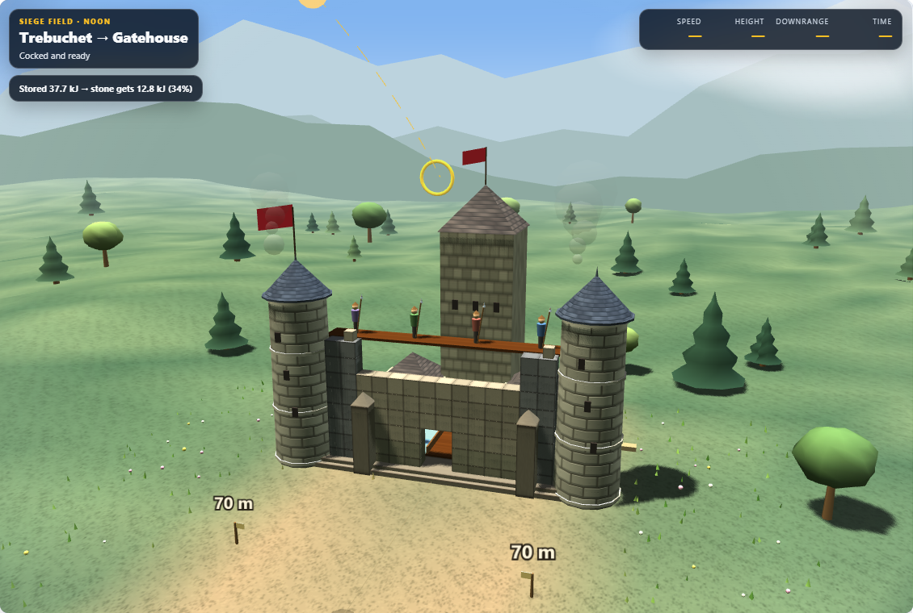
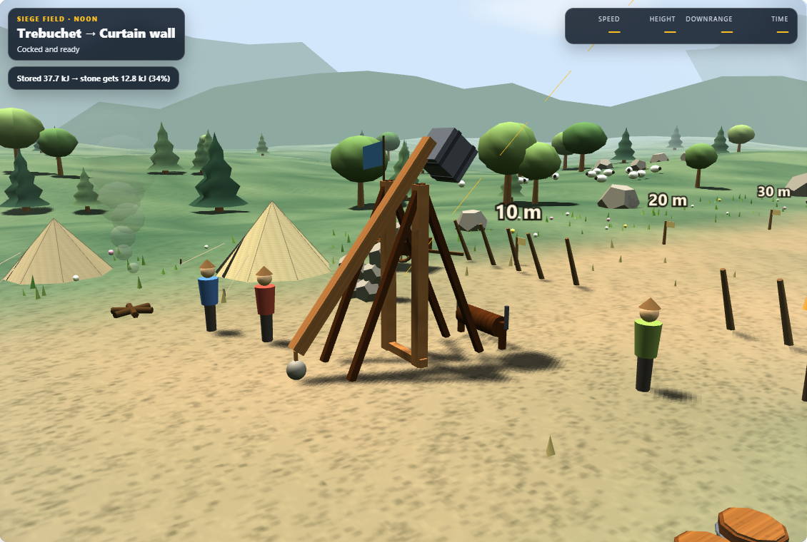
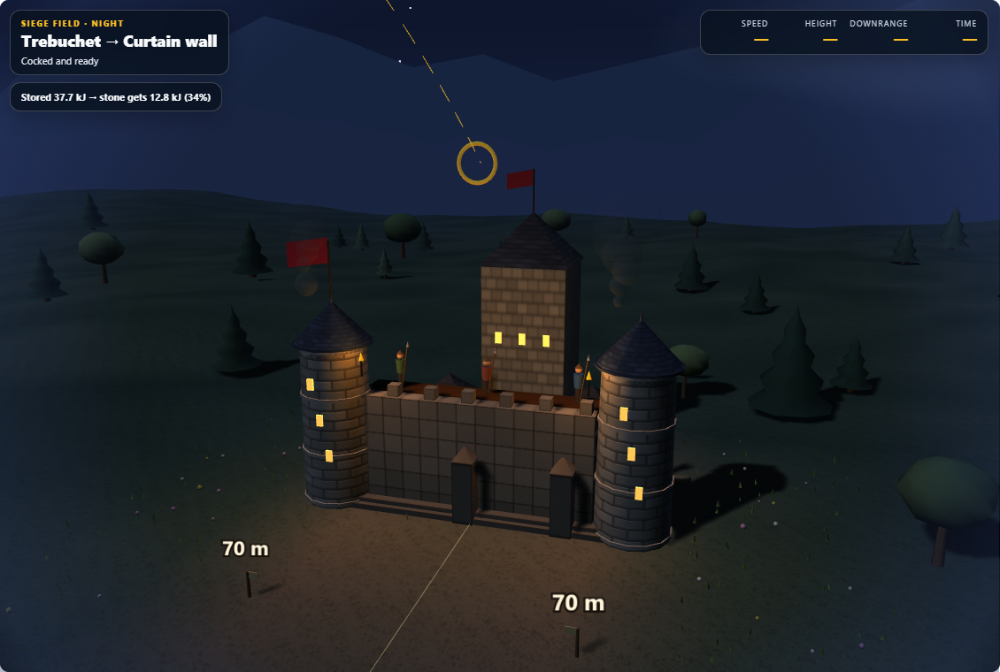

# Machine Lab: third visual pass

The field now has staggered stonework, shingled roofs, varied tree silhouettes, canvas tent seams and guy ropes, cart spokes and hubs, and barrel hoops and lids. The target-wall bay shares the stone and timber materials, and workshop platforms have subtle surface grain.

Castle framing includes the keep and flags. High contrast has its own framing so the towers stay fully visible. The target-wall trajectory uses a darker amber on light backgrounds and stronger opacity during flight.

The decorative changes leave the damage model and shot calculations intact. Trees retain instanced rendering with one geometry per species; the new crown geometries stay below 250 triangles each. Surfaces are generated locally without downloaded assets.

## Verification

- Full Machine Lab regression suite: **703/703 tests passed**. See [test results](pass3-tests.json).
- Real Chromium/WebGL review across 23 workshop, build, range, siege, and field states; additional final captures cover daylight, night, high contrast, and the trajectory correction.
- The browser checks reported no page errors or horizontal overflow at the 390px mobile check.
- Three new tests verify deterministic, bounded foliage geometry and tent attachments. Existing geometry tests also cover moving machines and reduced motion.
- Main and desktop source copies are byte-identical. [Verification summary](pass3-summary.json).

## Visual review

[High contrast](pass3-contrast-final/field-castle-detail.png) · [Target-wall trajectory](pass3-siege-final/09-siege-fresh-detail.png) · [Phone workshop](pass3-bays/mobile.png)

[Previous visual pass](pass2-review.md)
