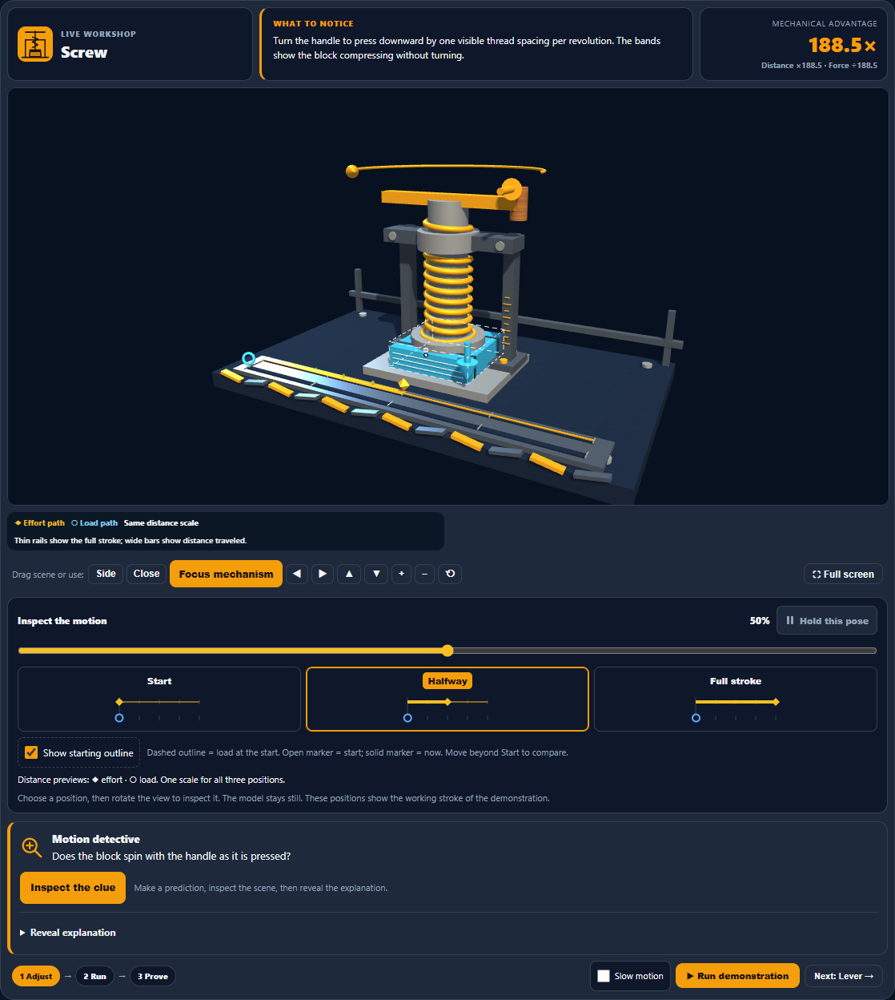

# Machine Lab: clearer visual hierarchy

The workshop now has an illustrated header above the 3D scene. Station information no longer covers the model on desktop. A matching machine schematic identifies each station, observation text is larger and left aligned, and the mechanical-advantage readout has clearer typography. Cards follow the selected light, dark, or high-contrast palette.

On phones, the station and metric share the first row, with guidance across the full width below. The mobile column override was corrected after screenshot review found clipped text.

## Validation

- 255 existing view, camera, accessibility, and translation tests passed. The station-icon assertion is now scoped to the navigation tabs because the selected schematic also appears in the header.
- All six stations checked at 1150, 720, 600, 390, and 320 pixels in three themes: 108 checks and 30 screenshots, with no recorded errors, clipped header text, or horizontal overflow.
- A complete playback and header diagnostic run passed 30 checks, covering exact-pose hold, restart timer isolation, keyboard inspection, and motion-off behavior.
- Reviewed desktop light and dark, tablet light, narrow-phone light, and phone high-contrast screenshots.
- Source and desktop mirror are byte-identical; production JavaScript parses successfully.

Earlier broad playback attempts timed out around hold/restart waits. The final complete diagnostic run passed; the earlier timeout cause was not established. Existing React key warnings remain outside this presentation change.

## Evidence

- [UI tests](pass32-tests.json)
- [Light layout](pass32-light-layout/results.json)
- [Dark layout](pass32-dark-layout/results.json)
- [High-contrast layout](pass32-contrast-layout/results.json)
- [Completed playback check](pass32-playback-diagnostic/results.json)
- [Summary](pass32-summary.json)

Changes remain local. Publishing remains paused.
