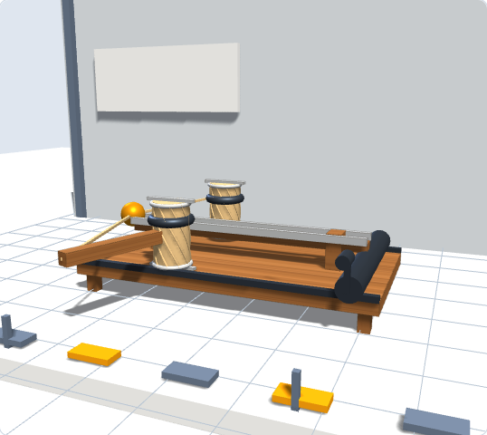
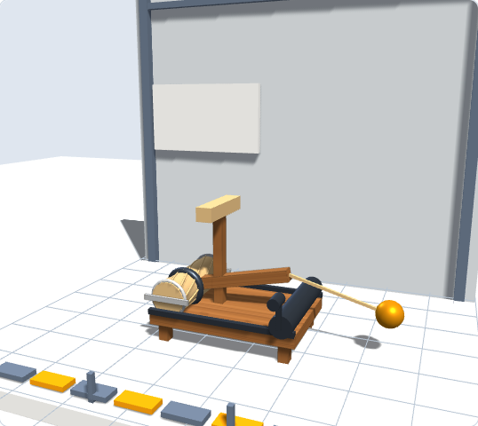
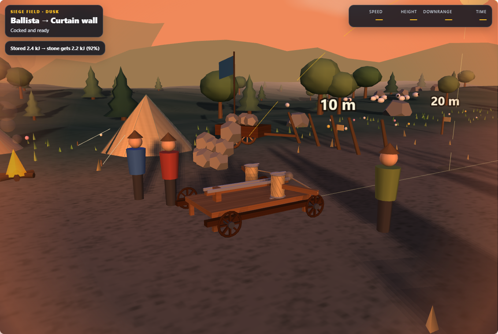

# Machine Lab: fourth visual pass

The ballista and onager now show more of their construction, and their moving parts stay visibly connected in the Build, Target Wall, and Siege Field views.

- Ballista arms sweep horizontally above a wider timber deck. Two string segments meet at the stone, with raised guide rails along the stock.
- String endpoints use the engine's local coordinates, fixing detached strings when an engine is translated and rotated into the field.
- Torsion bundles have ten visible twisted strands, metal collars and locking bars. Ballista pivot pins align with the vertical bundles.
- The onager sling follows its arm tip and payload while clearing the deck. Zero sling length is supported explicitly.
- Both engines launch from the visible attachment point, removing the jump to the pivot at release. A shot clock starting at zero now advances correctly.
- Field carriages have spoked wheels and metal hubs, sized to match the engine deck.

## Verification

**710/710 Machine Lab tests passed.** Seven new geometry tests cover the two bowstring endpoints in standalone and transformed engines, onager sling lengths of 0, 1 and 2.5, release continuity, and reduced-motion settling.

The final real Chromium/WebGL runs covered seven engine states in both light and high-contrast themes, including release states and field placement. Both runs reported no page errors and no horizontal overflow in the 390px mobile check. Source syntax and whitespace checks passed; the desktop copy is byte-identical.

The first concurrent verification attempt hit timeouts. The completed regression and browser results linked here come from the successful reruns.

## Visual review

[High contrast](pass4-contrast/torsion-ballista-detail.png) · [Zero sling length](pass4-final/torsion-onager-zero-detail.png) · [Verification summary](pass4-summary.json) · [Previous pass](pass3-review.md)
