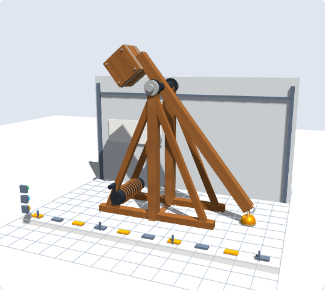
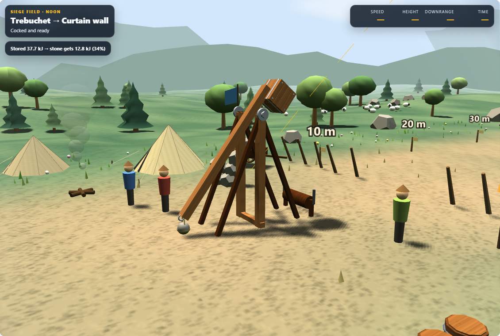

# Machine Lab: fifth visual pass

The trebuchet has a banded timber counterweight with panel seams and corner bolts, axle caps and nuts, a release ring, and a two-cord sling with a visible pouch. The shared model brings these details to the Build, Target Wall, and Siege Field views.

Loading and firing now use the same sling pose calculation. The pouch rises continuously instead of snapping to the full sling length at the start of a shot. The projectile leaves from the pouch in model coordinates, fixing both the position jump at release and the inherited rotation that distorted its launch direction.

Long-arm configurations raise the drawn pivot enough to keep the loading stone above the surface. Zero sling length is supported. The demonstration clock advances correctly when its first timestamp is zero.

A field decorator now checks for a finite cube width before adding counterweight bands, so it cannot mistake the new release ring for a cube and create invalid geometry.

## Verification

**719/719 Machine Lab tests passed.** Nine new tests cover loading clearance at 1, 4.5 and 8 metre arm lengths, both sling endpoints in standalone and transformed engines, release continuity and direction at 15, 45 and 75 degrees, zero sling length, and reduced-motion settling.

Final Chromium/WebGL runs captured five views in each of the light and high-contrast themes. They reported no page errors or horizontal overflow at the 390px mobile check. The initial field geometry warning was fixed and the final captures rerun. Main and desktop source copies are byte-identical.

## Visual review

[Long-arm configuration](pass5-final/trebuchet-long-detail.png) · [High contrast](pass5-contrast/trebuchet-ready-detail.png) · [Verification summary](pass5-summary.json) · [Previous pass](pass4-review.md)
