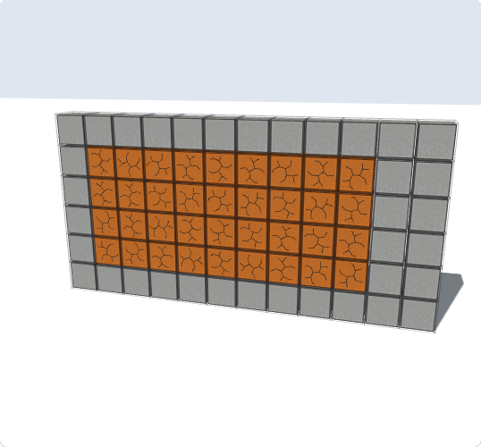
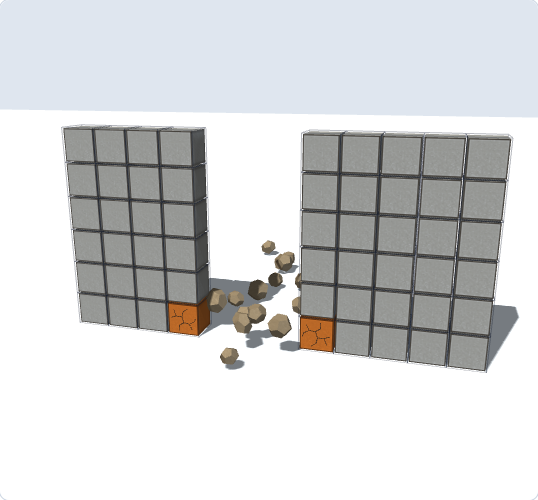
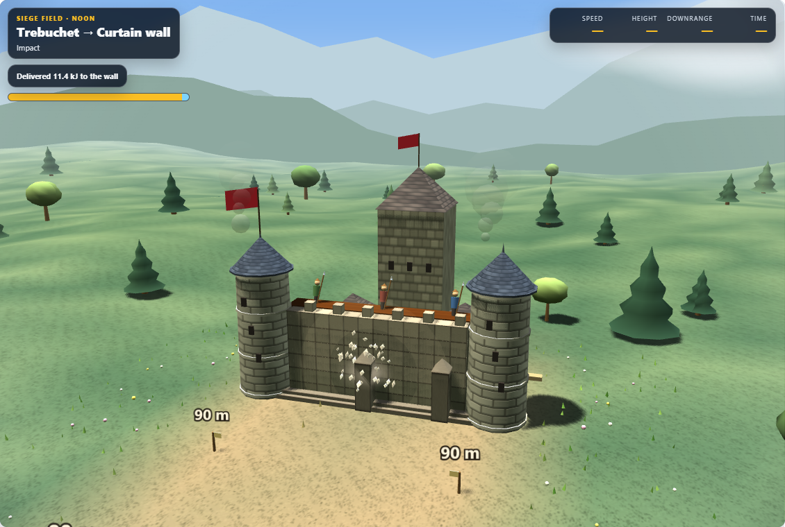

# Machine Lab: sixth visual pass

Wall damage is easier to read in both the Target Wall and Siege Field views.

- Branching fracture marks appear on both faces of cracked blocks and remain visible when the camera orbits behind the wall. The reusable pool supports up to 256 marked blocks, replacing the field's 24-mark limit. High contrast gets the same geometric fractures.
- Target Wall rubble uses the settled positions and rotations from the debris model, with irregular stone shapes, lighter exposed surfaces, and ground shadows. It reads the current debris data after each shot instead of retaining the data from the initial scene build.
- Decorative impact chips share a low-poly irregular geometry with varied proportions. Chips and dust now emerge from the struck wall face rather than starting inside or behind it.
- Fractures still wait until impact; both fracture marks and settled rubble clear when the wall resets. The falling-block physics remains unchanged.

## Verification

**725/725 Machine Lab tests passed.** Six new tests cover more than 24 cracked blocks, both wall faces, high contrast, live settled transforms, reveal timing, and outward-moving impact chips that expire correctly.

Chromium/WebGL captures use damage generated by the simulation's impact and debris solvers. Final light and high-contrast runs reported no page errors or horizontal overflow in the 390px mobile check. The transient impact screenshot uses controlled replay frame steps in the generated review page only. Main and desktop source copies are byte-identical; syntax and whitespace checks passed.

## Visual review

[Rear face](pass6-final/damage-cracked-rear-detail.png) · [Field damage](pass6-final/damage-cracked-field-detail.png) · [High contrast](pass6-contrast/damage-cracked-wall-detail.png) · [Verification summary](pass6-summary.json) · [Previous pass](pass5-review.md)
