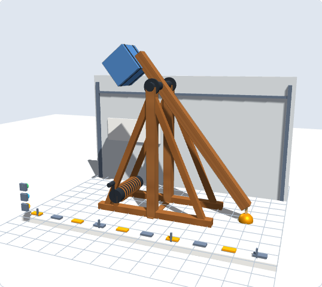
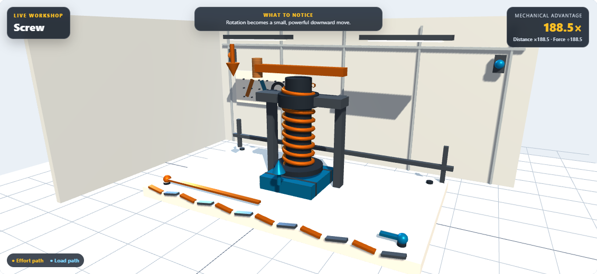
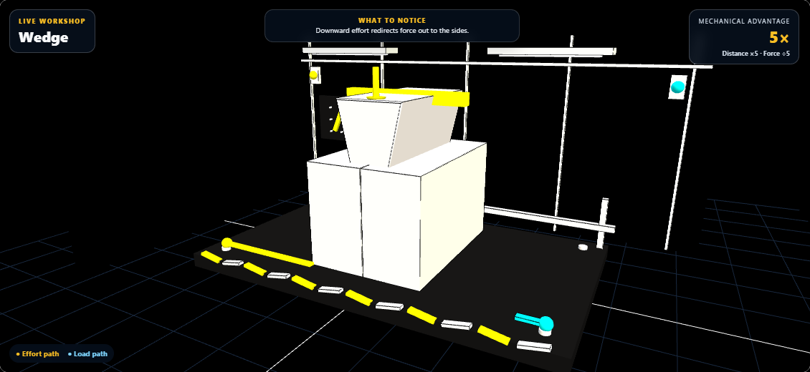

# Machine Lab visual upgrade review

Implemented September 8, 2026. Source and desktop public mirror are identical.

## What changed

- All six machine benches use textured timber, enamel-like effort/load surfaces, metal fittings, and visible part seams. Existing amber/cyan force and distance encoding is retained.
- Lever: pivot axle, bearing caps, and beam graduations; load straps move with the load.
- Pulley: detailed sheaves, spokes, hubs, and supporting ropes that stay attached to the fixed support and moving crossbar, including six-segment configurations.
- Wheel and axle: crank grip, crossed spokes, drum flanges, rope windings, and a hanging rope that shortens with the lifted load.
- Inclined plane: side rails and corrected surface geometry. The crate stays on the ramp at every supported incline, including a vertical plane, and travels along its slope.
- Wedge: a beveled, extruded blade with a continuous cutting edge; explicit blade and block boundaries remain visible in high contrast.
- Screw: one continuous helical thread, a fixed guide frame and nut, a pressure plate, and a press stroke that stays above the platform.
- Trebuchet, ballista, and onager build bays: textured timber, steel fittings, load bands, bearings, winding hardware, and trebuchet braces. The Siege Field shares the richer wood texture and physically based engine materials.
- Decorative workshop lights stay still under reduced motion. Other demonstrations use their existing viewer lifecycle; no new continuous animation loop, downloads, or post-processing passes were added.

The physics, scoring, energy ledger, grade-band content, saved state, and model-derived trajectories remain in their existing code paths.

## Validation

- **692/692 tests passed**, combining the complete Machine Lab run with the scene and geometry rerun after fixing the Windows newline reader.
- Ten new geometry tests cover ramp contact and travel, rope attachment, press clearance, and reduced-motion stability using the actual Three.js geometry builders.
- The untouched baseline reproduced all 17 initial scene-test failures. Those assertions assumed LF line endings; the reader now normalizes CRLF without weakening assertions.
- Real Chromium loaded the existing React host, vendored Three.js and OrbitControls. Eleven scene states plus a phone layout were captured in light, dark, and high contrast. No browser errors or phone horizontal overflow were reported.
- Final high-contrast blade outlines were recaptured separately. Source syntax and diff whitespace checks passed; source and deployment mirror match byte for byte.
- These captures verify appearance and behavior, not a frame-rate benchmark on physical school hardware.

## Visual samples

Before and after trebuchet build bay:

[Before](before/05-build-trebuchet.png) · [After](light/05-build-trebuchet-detail.png)







[Light workshop](light/01-machines-lever.png) · [Dark workshop](dark/01-machines-lever-dark.png) · [Phone](light/mobile.png) · [Siege Field](light/field-engine-detail.png)

## Reproduce

Run the focused renderer from the project root:

```powershell
node dev-tools/ml_visual_upgrade_qa.cjs reports/machinelab-review
node dev-tools/ml_visual_upgrade_qa.cjs reports/machinelab-review-dark --dark
node dev-tools/ml_visual_upgrade_qa.cjs reports/machinelab-review-contrast --contrast
node node_modules/vitest/vitest.mjs run tests/machinelab --pool=threads --maxWorkers=1
```

The visual harness accepts an optional filter, for example `--only=wedge`.
