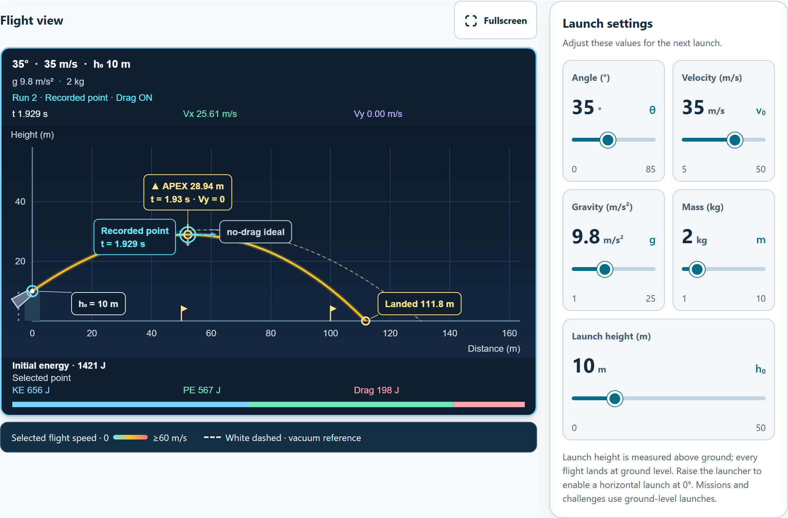

# Physics workbench visual review

## Changes

- Place launch settings beside the flight plot on desktop. On phones, settings follow the plot and precede secondary controls.
- Add a named settings panel, explicit units beside all five values, and a full-width launch-height card on phones.
- Give the seven view controls SVG icons and visible ON/OFF badges. Preserve their native keyboard behavior and pressed-state announcements.
- Use regular playback cells and two-column gravity presets on phones. Increase range inputs, estimation input, and fullscreen control to at least 44 pixels high.
- Put the labeled fullscreen control above the plot. Update its label when native fullscreen ends through the browser; retain the CSS fallback for rejected requests.
- Apply the high-contrast Launch colors in the primary control group.

[Phone controls](controls-final-default-320.png) · [Dark phone workbench](workbench-final-dark-320.png) · [High-contrast phone workbench](workbench-final-contrast-375.png)

## Visual verification

The audit captures two baseline layouts from commit `5a98bb0fa28b9ba2f87f443d2340115c92180a38` and nine final layouts at 1100, 375, and 320 pixels. The report contains 24 screenshots and [machine-readable results](controls-results.json).

| Theme | Smallest text | Lowest text contrast | Smallest control height | Page overflow |
| --- | ---: | ---: | ---: | ---: |
| Default | 12 px | 5.20:1 | 44 px | 0 px |
| Dark | 12 px | 5.90:1 | 44 px | 0 px |
| High contrast | 12 px | 15.30:1 | 44 px | 0 px |

These measurements cover the primary controls, workbench, plot key, and secondary controls. Disabled text is excluded from contrast thresholds. Disabled targets are included in size measurements. Fonts continue to inherit the app's reading preferences.

At 320 pixels in the default theme, the secondary control section measures 1189 pixels high, down from 1320. Desktop cards use more vertical space to display separate titles and states.

Each configuration records a vacuum flight and an air-drag flight. Their bodies, run logs, last-flight records, trail samples, launch parameters, and apex records match the pinned baseline. Fourteen view toggles and six inspection navigation actions preserve that evidence.

## Regression checks

- Physics unit suite: 252 tests passed in 16 files.
- Complete physics browser suite: 106 tests passed in 16 files, with one worker and no retries.
- The new browser file covers view keyboard toggles, parameter units and mission locks, playback and gravity controls, fullscreen events and fallback, focus outlines, and nine layout/theme combinations.
- Native fullscreen transitions use deterministic API mocks. The check verifies event handling and labels; it does not exercise the operating system's fullscreen UI.
- The source and desktop mirror are byte-identical. English catalogs add five physics keys.

## Reproduce

Run `node reports/physics-control-visuals-2026-09-30/verify-controls.cjs` from the repository. It loads the pinned baseline, verifies current source and mirror parity, captures layouts in one Chromium process, and rejects source, auditor, or dependency changes during the run.

Run the unit and browser commands in [.github/workflows/physics.yml](../../.github/workflows/physics.yml). The workflow includes the new control checks and uses one browser worker with no retries.

Final source SHA-256: `77cc2ca00d6eedbbd6012d58fcc7d0b841e3cf2a35b5bf3f1536b650d6315e45`.
