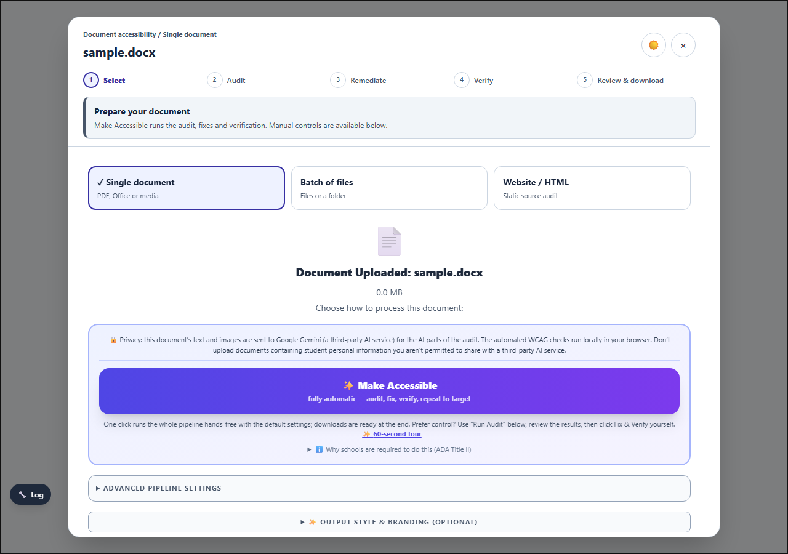
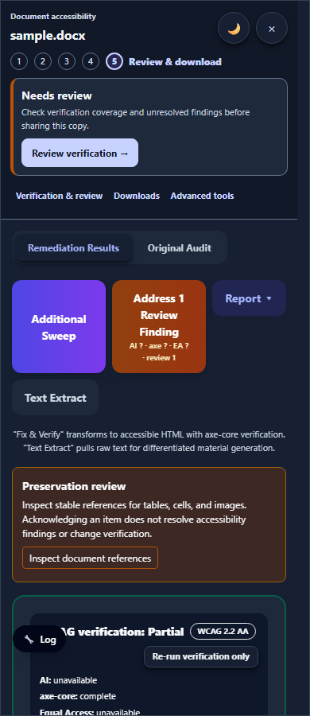
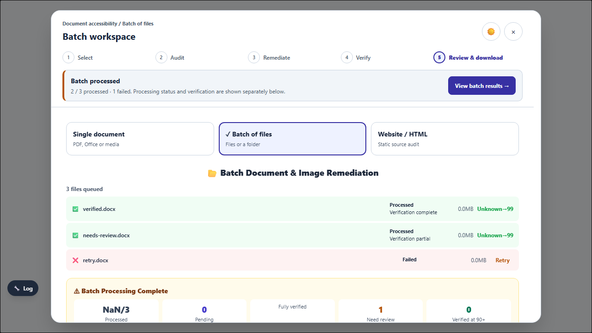

# Remediation workspace UI implementation — 12 September 2026

Implemented the first UI pass from the [pipeline review](../remediation-continuity-2026-09-12/README.md). The view continues to own its active jobs throughout navigation; the workspace shell is kept mounted.

## What changed

- Persistent document identity and a five-stage tracker: Select, Audit, Remediate, Verify, Review & download. Stages describe the current activity; a pass reaching 100% does not mark the entire job finished.
- A concise status and next action for preparation, active remediation, AI waiting, paused/interrupted work, verification and review. A high score alone cannot produce the ready state: the summary uses canonical verification evidence and the pipeline distribution verdict.
- Clearly separate Single document, Batch of files and Website / HTML source choices. Active jobs lock these controls, including the interval before React renders its busy state. A visible check identifies the selected source in high contrast.
- Manual audit and text extraction are folded into a disclosure. The native After remediation selector uses Show results, Review changes and Open editor, and explicitly explains that it applies to manual Fix & Verify. Make Accessible retains its automatic results flow.
- Result navigation opens collapsed sections, focuses the destination, and accounts for the sticky header height. Download formats and the advanced workbench can be reached directly without recreating the view.
- Removed unconditional share-ready / optional-polish wording from the results guidance. Incomplete verification directs the user to review coverage and findings.
- Batch rows distinguish Queued, Running, Processed and Failed from verification. Rows remain available after processing finishes, so failures retain a visible Retry action. File removal has a document-specific accessible name.
- Responsive layouts at 320, 390 and 1280 pixels, theme-aware controls, reduced-motion support, and wrapping for long evidence chips and export controls. The result panel no longer slides underneath navigation targets as it enters.
- Manual Audit, Retry Audit and Make learning materials now use the same live ownership guard as the modal controls, protecting one-click remediation and finalization against competing starts or teardown.

The presentation is in `remediation_workspace_component.jsx` and `remediation_workspace.css`, included by `_build_view_pdf_audit_module.js`. The regenerated root module and desktop public module are identical. No additional runtime stylesheet fetch is required.

## Verification

The maintained remediation command passed **642 tests: 428 unit tests and 214 browser tests**, with no skipped or retried tests. See [validation summary](validation/summary.json).

After the final manual-start guard changes, focused unit and browser checks cover mode selection, duplicate starts, audit retry locks, navigation/focus, mounted-view identity, provisional results, batch retry availability, responsive layouts and accessibility of the new header/source controls. The visual checks use the existing application stylesheet and theme layer. **All 84 focused unit tests and 8 browser tests passed** after those changes. See [final checks](final-checks.json) and [unit results](final-unit.json).

The supplemental suite passed 95 tests and reported two **global theme maintenance failures**: the generated AppStyles block differs from the current aggregate generator output, and `enabled:hover:bg-indigo-50` in `games_source.jsx` is unsupported by that generator. These are outside the remediation workspace change; the shared AppStyles files were not regenerated over concurrent work. Details: [supplemental results](supplemental-tests.json). The new workspace controls pass their browser accessibility scans in light, dark and high-contrast themes.

Pipeline integrity, host/source JSX smoke checks, generated-script syntax checks and whitespace checks passed. Provider calls and manual screen-reader sessions were not exercised in this UI pass.

## Preview

Desktop intake:

Phone results in dark mode:

Batch processing results:

## Further work

The main opportunities left are consolidating deeper issue/editor dialogs into a shared review panel and grouping the large set of export and repair tools more extensively. Background/minimized execution would require moving long-lived job ownership out of this view before allowing it to unmount; this pass deliberately keeps ownership stable.
