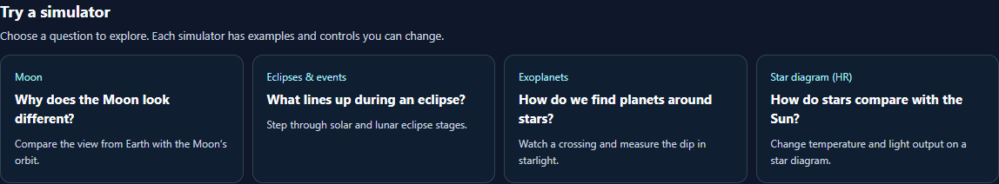
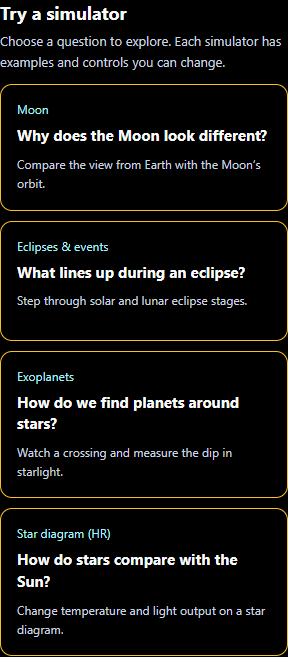
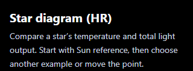

# Sky Lab: clarity and navigation

Completed September 29, 2026. See the [latest verification](../sky-lab-seasons-2026-09-29/README.md).

## What changed

- **A clearer starting point:** Tonight now offers four question-based routes to the Moon, eclipse, transit and star-diagram simulators.
- **Organized navigation:** the section picker groups all 18 destinations into Explore the sky, Try a simulator, Learn about space, and Tools and practice. Existing saved section IDs remain compatible.
- **Descriptive names:** Events is now Eclipses & events; HR Diagram is Star diagram (HR); Observing is Telescopes & observing.
- **Relevant guidance:** section introductions explain what users can do and where to begin. They replace the generic observing-plan banner that appeared over unrelated simulators, reference topics and quizzes.
- **Predictable section changes:** a newly selected section starts at the top. Ordinary control edits preserve the current scroll position. Links inside the content hand keyboard focus to the destination panel; tabs and the section picker retain their focus.
- **Plain simulator language:** the transit control reads Path offset (star radii), with impact parameter defined in the explanation. Star-diagram controls spell out temperature and the Sun reference, and explain luminosity, kelvin and logarithmic spacing.
- **Clearer investigation actions:** Log this star and Show investigation hints describe their actions. The Reset investigation explanation states that logged stars and writing will be cleared and points to Sun reference for moving the point while keeping notes.

## Verification

- **169 unit checks passed across five files.** The final run covers UI resilience, semantics, contrast, saved-state handling, playback ownership, HR calculations and transit geometry. [Final unit results](unit-final.json).
- **11 Chromium browser checks passed** with no retries, skips, flaky outcomes or page errors in the checked flows. They cover the new navigation and focus behavior plus the existing transit, HR and eclipse interactions. [Browser results](browser-tests.json).
- **Two layout checks passed again** after the final card-alignment adjustment. [Final layout results](layout-final.json).
- Desktop and 320 px contrast screenshots were inspected. The phone journey checked seven content sections for horizontal overflow.
- Source syntax and scoped whitespace checks passed. Simulator source and desktop public assets match. **42 English string keys** were added to both registries.
- The first unit run flagged an obsolete source-text assertion after the panel moved into its own component. Rendered semantics were already covered; the final run passes.

These checks cover local Chromium and the affected unit suites. No deployment was made.

## Simulator routes on desktop

## Simulator routes on a phone

## Contextual guidance on a phone

