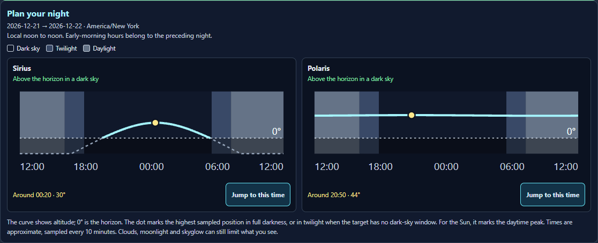
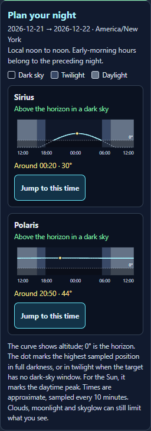
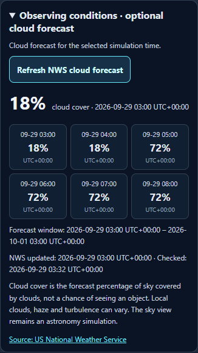

# Sky Lab: observing tools and reliability

This pass adds a visual night planner, optional National Weather Service cloud forecasts, and a clearer path from finding an object to saving and viewing it.

## What changed

- **Plan your night:** saved targets have compact altitude charts, a horizon line, daylight and twilight shading, and a recommended observing time. Each recommendation opens that target at the selected time. The local-noon-to-noon window handles 23- and 25-hour daylight-saving transitions, polar conditions, and the supported date range.
- **Clearer target workflow:** object details appear next to the finder. Saved target names are buttons, and opening a target moves keyboard focus to the sky or the explanation of why it is hidden. A selection survives leaving and returning to the Observatory and continues to update when time changes.
- **Optional cloud forecasts:** a collapsed Observing conditions panel fetches National Weather Service cloud-cover data only after the user asks. Percentages apply to the selected simulation time, with local timestamps, UTC offsets, forecast coverage, and source freshness. Unsupported locations, old snapshots, missing intervals, playback, and historical dates have explicit states.
- **More reliable time controls:** changing the clock zone or observing site, freezing Live now, and stepping time preserve the moment actually reached during playback. Playback stops once at the last supported local minute in 2099; it can restart after jumping back.
- **Complete catalog selection:** the 50 catalog entries without HIP numbers now have stable, distinct identities. They can be found, selected, saved, and reopened without sharing a false HIP 0 identity. Malformed coordinates are rejected.
- **Accurate guidance:** a twilight opportunity is labeled as twilight when the Sun is above −18°. The new planner samples target paths every ten minutes and uses the existing observer-corrected lunar position.

The source module, desktop public copy, and 49 new English string keys are synchronized. The tour guidance now points to the target button below the finder. Existing unrelated workspace changes were preserved.

## Real-world data and limits

The Observatory retains its measured HYG star catalog, computed Sun/Moon/planet positions, and optional NOAA aurora data. This pass adds official NWS grid forecasts for supported US and territory locations.

The weather adapter was checked against the [NWS API documentation](https://www.weather.gov/documentation/services-web-api), the [official grid schema](https://github.com/weather-gov/api/blob/master/gridpoints.md), and a live [Moosehead Lake point response](https://api.weather.gov/points/45.58,-69.72). It validates the requested location, official grid URL and identity, units, intervals, and timestamps. Requests have a total timeout and cleanup; failed refreshes retain a usable saved forecast with a visible warning.

Cloud cover is a forecast of the percentage of sky covered by clouds. It does not predict the chance of seeing a target or alter the rendered sky. Terrain, haze, turbulence, and local clouds remain outside the rendering model. A previous forecast is withheld when it is stale or does not cover the selected time. Browser regression tests use deterministic NWS fixtures; the live endpoint was checked separately.

## Verification

**440 unit checks passed across all 18 astronomy test files.** Results are split between `unit-tests.json` (382 checks) and `unit-recheck.json` (58 checks). The first runner timed out while terminating a worker and did not record four files; those files passed in a separate single-worker run, with no source changes between runs.

**31 browser checks passed with no retries, skips, or failures** in the completed run (`browser-tests.json`). The initial two new workflow checks also passed and are recorded in `workflows-browser.json`. An earlier broad browser run encountered a context-teardown timeout and ended before saving a complete report; the completed run uses a separate artifact directory. The only subsequent UI edit during verification was the tour guidance sentence described above.

The checks cover night planning, keyboard focus, saved-target restoration, date and time controls, mobile overflow, catalog recovery, weather coverage and refresh errors, and renderer cleanup. Focused runtime checks also cover playback reaching the end of 2099 in UTC, New York, and Auckland, including delayed parent updates and restarting after a date change.

Visual checks passed at 1440, 1180, 390, and 320 pixels. The 390-pixel navigation journey opened all 18 sections without browser errors or horizontal document overflow. Final measurements are in `final-browser.json`; `verify-results.cjs` consolidates the results and checks mirror and string consistency. Module syntax and scoped `git diff --check` also passed. The final tour wording correction was followed by fresh screenshots and the section journey.

## Screenshots

Full Observatory: [desktop](final-desktop.png) · [phone](final-phone.png)

### Night planner on desktop

### Night planner at 320 pixels

### Optional weather panel on phone

These screenshots show the local development component. This pass did not deploy the application.
