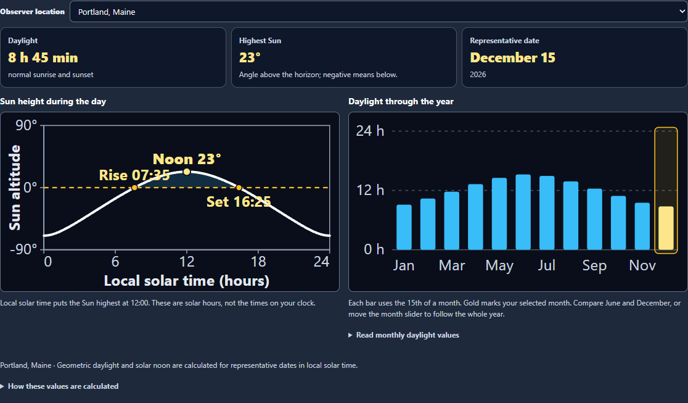
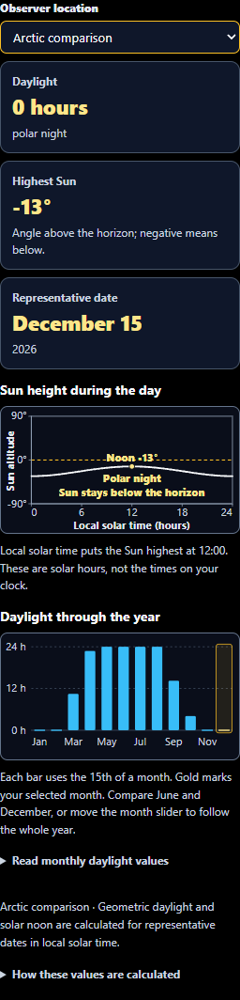

# Sky Lab: clearer Seasons comparisons and final verification

Completed September 29, 2026.

## This pass

- Three visible readouts show daylight, the highest Sun angle and the representative date. Negative Sun heights are explained directly.
- March, June, September and December buttons offer quick comparisons and retain keyboard focus. The month slider, daily graph, readouts and selected annual bar stay synchronized.
- A twelve-month daylight chart uses the same solar model and observer as the daily graph. It makes the opposite seasonal patterns in Portland and Sydney easy to compare. A collapsible table provides every monthly value.
- Daily and annual graphs sit beside each other on desktop and stack on phones. Daylight, date and clock explanations stay visible; the detailed calculation limits are available under How these values are calculated.
- Polar and brief horizon-graze captions wrap inside the graph. Zero-hour months retain a visible baseline marker and selection outline.
- Nineteen new English keys and the desktop public simulator copy are synchronized.

## Data and interpretation

These graphs calculate geometric daylight for the 15th of each month in the current year. They use the existing solar-position model and selected observer latitude. Values are representative calculations, rather than observed weather or exact solstice dates. Local solar noon is 12:00; the chart is not a civil-clock forecast. Refraction, elevation, terrain, weather, daylight-saving time and thermal lag are outside this model.

The full Sky Lab enhancement also includes measured catalog stars, observer-corrected lunar positions checked against NASA/JPL fixtures, optional NWS cloud forecasts, night planning, interactive Moon/eclipse/transit/star diagrams, and clearer navigation. Earlier verification and screenshots are recorded in the linked reports below.

## Verification

- **498 unit checks passed across 21 files.** [Broad unit results](unit-final.json) cover Sky Lab calculations, rendering, catalog recovery, forecasts, clocks, playback cleanup, navigation and simulator input handling.
- **Four distinct Chromium checks passed** in the Seasons run with no retries or skipped tests. [Initial browser results](browser-tests.json) include the existing shared-observer phone regression.
- **All three new browser checks passed again** after wrapping the polar caption, including a check that its SVG bounds remain inside the graph. [Final browser results](browser-final.json).
- Desktop and 320 px contrast screenshots were inspected. The phone checks cover both polar day and polar night, 44 px month buttons, monthly table access and horizontal overflow.
- JavaScript syntax, scoped whitespace and simulator mirror checks passed. [Verification summary](verification.json) records counts and the source hash.

The broad unit run preceded the caption adjustment; all 11 Seasons checks passed again on the final source ([results](unit-layout-final.json)). Checks are local Chromium and unit coverage. No deployment was performed.

## Related work in this commit

- [Initial Sky Lab review](../sky-lab-review-2026-09-27/README.md)
- [Observing plans and official weather data](../sky-lab-enhancement-2026-09-28/README.md)
- [Moon, eclipse and stellar visual simulators](../sky-lab-simulators-2026-09-28/README.md)
- [Transit explorer](../sky-lab-transit-2026-09-29/README.md)
- [Navigation and plain-language guidance](../sky-lab-clarity-2026-09-29/README.md)

## Desktop

## Phone

