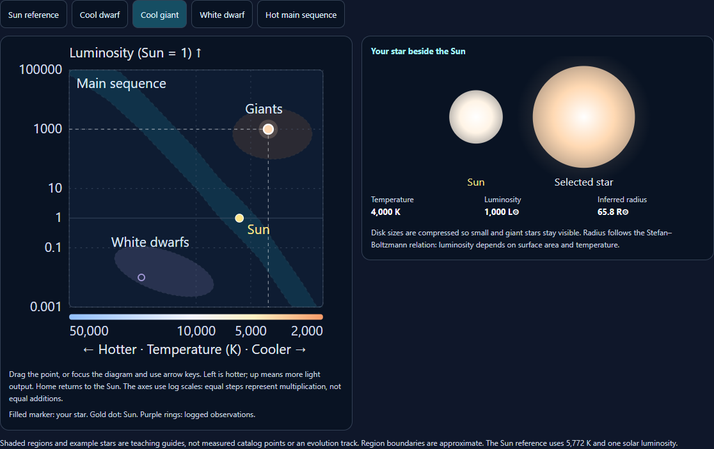
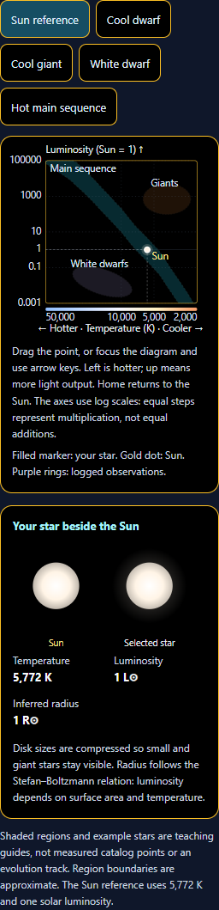
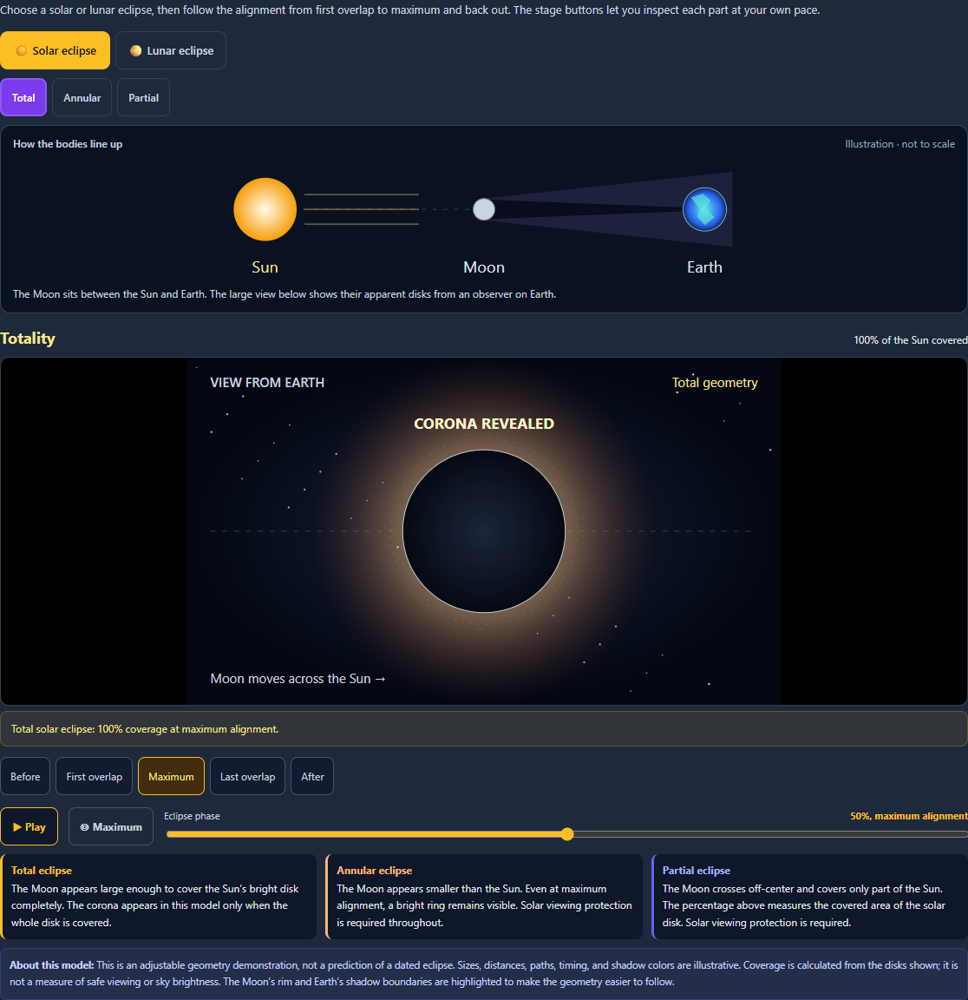
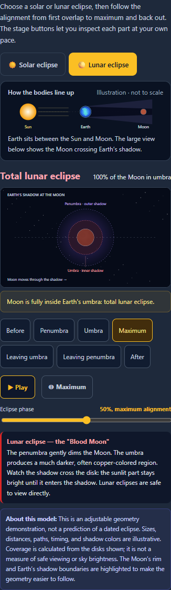

# Sky Lab: visual simulator enhancements

This pass improves the Moon, Eclipse, and HR Diagram sections. All changes use the existing local renderer and assets.

## Moon

- Portrait framing keeps the full lunar disk visible on a narrow phone.
- Zoom buttons and a numeric zoom indicator make the camera usable without a mouse wheel.
- Overview, Above orbit, and Edge-on presets make the Sun–Earth–Moon geometry easier to inspect.
- Projected Earth and Moon labels follow their objects. The orbit legend sits outside the canvas to avoid covering the scene.
- Visual phase buttons show the changing illuminated shape, and each viewing mode exposes relevant overlays.
- The existing NASA/LRO surface texture, lighting, orbital tilt, and eclipse geometry are preserved.

## Eclipses

- Added a labeled alignment guide, clearer stage headings, and shortcuts through the event.
- Solar coverage uses the overlap area of the displayed disks. The corona appears only during true totality; annular geometry leaves a bright ring.
- Penumbral and umbral shadows are clipped to the Moon, so the portion outside the shadow stays bright.
- Playback stops at After. Replaying starts at Before, and stage shortcuts pause the animation.
- The UI clearly identifies this as a geometry demonstration. It does not predict a dated eclipse; sizes, paths, timing, and colors are illustrative.

## Stellar explorer

The HR Diagram now contains an actual interactive chart, with hotter stars on the left and more luminous stars higher up. Both axes use logarithmic spacing. Users can drag the point, move it with arrow keys, try examples, or log positions for comparison.

A preview compares the selected star with the Sun. The radius is derived from luminosity and effective temperature using the Stefan–Boltzmann relation. Disk sizes and colors are illustrative; size compression keeps very small and very large stars visible. The Sun reference uses 5,772 K and one solar luminosity.

The luminosity slider now reaches faint stars easily. Exact preset and chart values remain synchronized with the sliders. Numeric changes are announced to screen readers, and controls have clear labels and touch targets.

Region labels describe approximate areas of the diagram. Hot, faint stars are no longer automatically described as main-sequence stars, and high luminosity alone no longer asserts a supergiant classification. Example stars and shaded regions are teaching guides, not catalog measurements or simulated evolution. Mass is recorded independently and does not change the plotted point.

Scientific references: [ESA’s explanation of the HR diagram](https://www.esa.int/ESA_Multimedia/Images/2018/04/Gaia_s_Hertzsprung-Russell_diagram), [IAU nominal solar conversion constants](https://www.iau.org/common/Uploaded%20files/IAUGA2015-Resolution-B3-recommended-nominal-conversion.pdf).

## Verification

Verified on September 29, 2026:

- **164 unit tests passed across six files.** These cover stellar calculations and input handling, Moon controls, eclipse coverage, playback cleanup, accessibility, and UI regressions. See [final unit results](unit-final.json).
- **8 distinct Chromium browser checks passed:** [3 HR/Eclipse checks](hr-eclipse-browser-tests.json), [2 Moon control checks](moon-controls-browser-tests.json), and [3 Moon rendering regressions](moon-regression-browser-tests.json).
- Both HR checks passed again after the final chart margin adjustment. See [final HR layout results](hr-layout-browser-tests.json). The 320 px contrast screenshot was visually inspected for readable labels and overflow.
- Browser checks cover pointer and keyboard input, saved observations, zoom and camera controls, eclipse stage changes, Moon lighting orientation, cleanup, and bounded WebGL resources. These runs reported no page errors in the checked flows.
- JavaScript syntax and scoped whitespace checks passed. The source and desktop public simulator files have matching SHA-256 hashes; 68 English UI strings were synchronized.

Development checks found and fixed two integration errors: a readout helper outside its scope and a translated renderer label outside its scope. Slider precision and diagram keyboard feedback were also corrected before final checks. Earlier development reports are retained; the final results above supersede them.

These are focused local checks of the changed simulators, not a full application or cross-browser certification.

## Screenshots

### Moon on a phone

### Moon orbit view

### Stellar explorer

### Stellar explorer on a narrow contrast screen

### Eclipse geometry

### Lunar eclipse on a phone

The changes are local and mirrored to the desktop public assets. This pass does not deploy the application.
