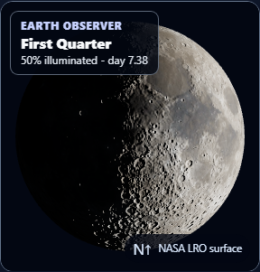
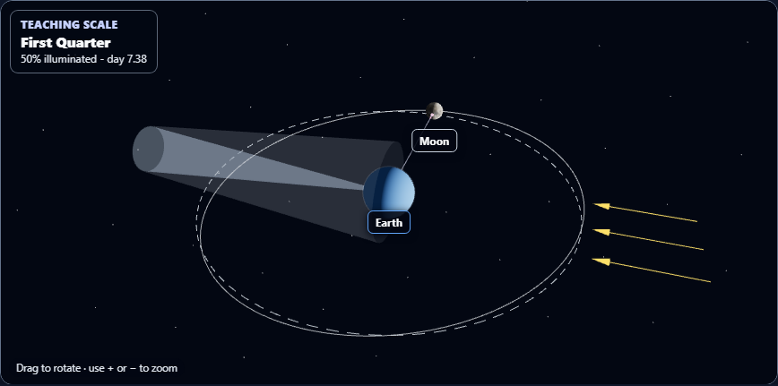

# Moon simulator visual enhancements

## Changes

- Telescope framing now fits the complete lunar disc to the shorter screen dimension. At the default zoom, a narrow phone no longer crops the Moon horizontally.
- Touch controls provide zoom in, zoom out and a zoom readout. Orbit view also has Overview, Above orbit and Edge-on camera presets.
- Earth and Moon labels follow their projected positions as the camera moves. The labels hide with the Labels control and are removed when the renderer unmounts.
- The orbit legend sits below the scene so it can wrap on small screens. Telescope view shows only the overlay control that affects that view.
- The four principal phase buttons include clear phase discs and larger touch targets. Existing phase and eclipse calculations, NASA surface assets, physical lighting and tidal locking remain in use.
- The phase live region stays quiet during playback and resumes announcements when paused.

## Verification

- `node --check stem_lab/stem_tool_astronomy.js`: passed.
- `node node_modules/vitest/vitest.mjs run tests/astronomy_moon_observatory.test.js --maxWorkers=1 --testTimeout=30000 --reporter=verbose`: **13 passed**, 91.31 seconds, on September 29, 2026.
- New Chromium interactions: **2 passed**, 5.6 minutes. These cover portrait framing, touch zoom/reset, context-specific controls, camera presets, label visibility and cleanup, page errors and horizontal overflow. See `moon-controls-browser-tests.json`.
- Focused Chromium regressions: **3 passed**, 1.4 minutes. These check the rendered illumination pixels in north-up and south-up views, HUD text contrast, overlay toggles, true scale and bounded WebGL resources. See `moon-regression-browser-tests.json`.

An initial browser check caught a renderer initialization error from a translation helper used outside its scope. The renderer now receives translated label strings from the view; both new browser checks passed after the correction. The earlier combined unit report also caught an H–R view issue that was handed to the main task for correction. `moon-unit-tests.json` records that earlier run, not the passing standalone Moon result above.

## Visual evidence

### Telescope view at 320 px page width

### Orbit view with object labels

