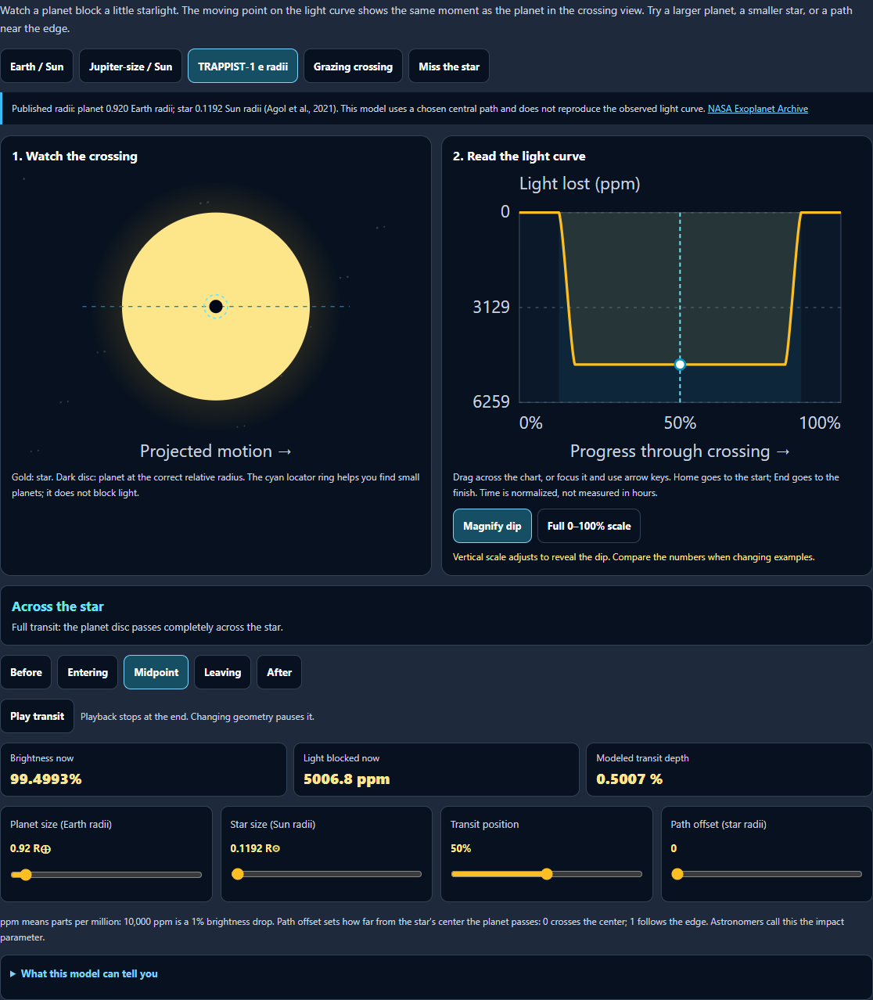
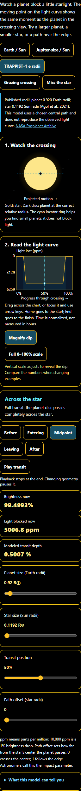

# Sky Lab: transit explorer

Enhanced the Exoplanets transit simulator on September 29, 2026. The explorer now appears near the top of the Exoplanets section.

## Visuals and interaction

- The planet crossing, light curve, live cursor and numerical readouts share one timeline and one circle-overlap calculation.
- A larger responsive scene shows the planet at its actual relative radius. A separate cyan locator ring makes small planets easy to find without enlarging the occulting disc.
- Users can scrub the chart with a pointer or touch, use arrow keys, jump between stages, and play or replay the crossing.
- Magnify dip reveals even sub-ppm changes. The fixed 0–100% scale lets users see how small these changes really are. The active scale is explained beside the controls.
- Readouts show brightness, blocked light in parts per million, and the maximum modeled depth. Stage descriptions distinguish full, grazing, missed, and complete occultation paths.
- Controls have 44 px touch targets. Phone layouts stack the views; contrast mode retains readable labels and a visible keyboard focus indicator.
- Playback stops at the end, pauses on geometry or time input, stays quiet for screen readers while playing, and releases its timer on leaving the section.

## Real-world reference and model limits

The TRAPPIST-1 e preset uses published radii: 0.920 Earth radii for the planet and 0.1192 Sun radii for the star. These come from Tables 6 and 7 of [Agol et al. (2021)](https://ntrs.nasa.gov/api/citations/20210000129/downloads/Agol_2021_Planet._Sci._J._2_1_Refining.Trappist1.pdf), also listed by the [NASA Exoplanet Archive](https://exoplanetarchive.ipac.caltech.edu/overview/TRAPPIST-1). The reference is a bundled literature example. It does not fetch a live observation.

The chosen central path, uniform stellar brightness and constant projected speed are teaching assumptions. The curve is calculated from those assumptions, rather than fitted to measured photometry. The UI explains that time is normalized and that limb darkening, starspots, atmospheres and measurement noise are omitted.

Radius conversion uses the [IAU 2015 B3 nominal Earth equatorial and solar radii](https://www.iau.org/common/Uploaded%20files/IAUGA2015-Resolution-B3-recommended-nominal-conversion.pdf). The Earth/Sun example yields approximately 84 ppm of dimming.

Removed fixed “visible” and “detectable” verdicts. Detection depends on the data quality and observing conditions; a depth threshold alone cannot determine it. [NASA Exoplanet Watch](https://science.nasa.gov/citizen-science/exoplanet-watch/background/) provides the observing context. Also corrected the discovery introduction to distinguish the 1992 pulsar discoveries from the 1995 Sun-like-star discovery, following [NASA’s historical account](https://science.nasa.gov/universe/exoplanets/nobel-winners-changed-our-understanding-with-exoplanet-discovery/).

## Verification

- **144 unit checks passed across four files.** Covers malformed saved state, published-radius precision, overlap geometry, symmetry, full occultation, eclipse/Moon/meteor/transit timer ownership, accessibility and existing UI resilience. [Final unit results](unit-final.json).
- **4 Chromium browser checks passed with no retries, skips or page errors in the checked flows.** Covers linked views, keyboard input, stage controls, published-reference labeling, touch input at 320 px, chart label bounds, horizontal overflow, scale extremes, playback completion/replay, and cleanup on leaving. [Final browser results](browser-final.json).
- Desktop and 320 px contrast screenshots were visually inspected.
- Source syntax and scoped whitespace checks passed. The simulator source matches the desktop public copy. **54 new English strings** were synchronized into both registries.
- These are focused local checks; other browser engines and physical devices were not tested in this pass.

All changes remain local and uncommitted. No deployment was performed.

## Desktop

## Phone with contrast enabled

