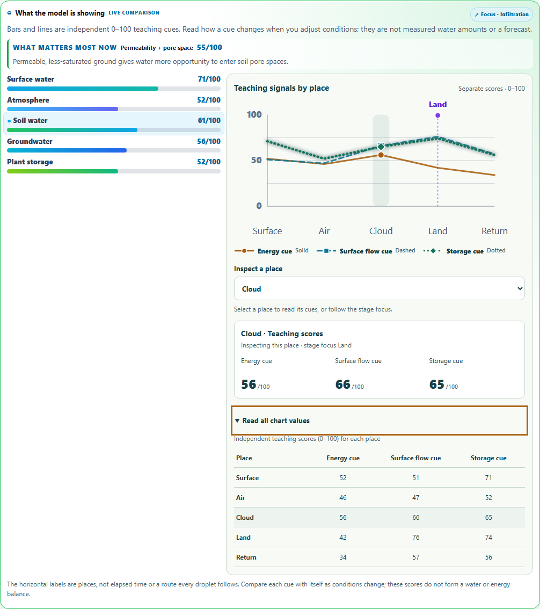
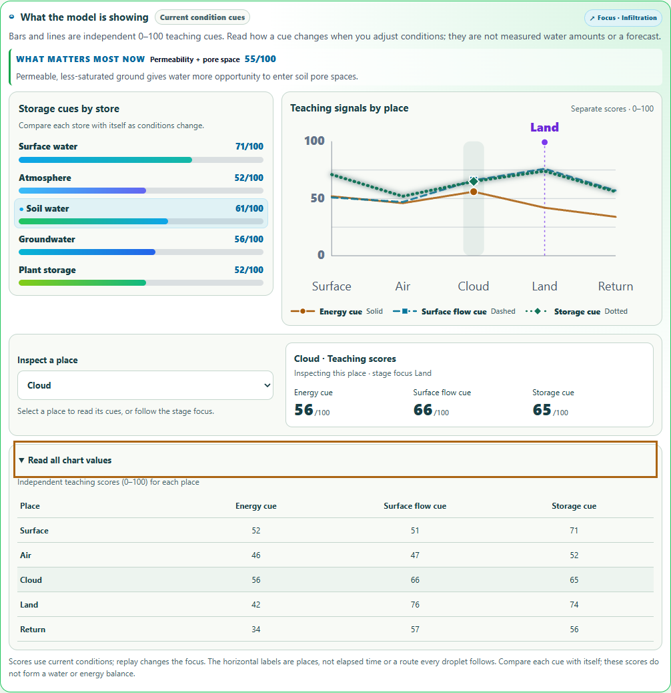

# Water-cycle dashboard layout

The dashboard now gives the plot, place inspection, storage cues, and exact-value table their own visual groups. Wide panels put the stores beside the plot and give the inspection row and table the full width below. Narrow panels follow the document order: plot → inspection → stores → table.

The visible **Storage cues by store** heading distinguishes the bars from the chart's **Teaching signals by place**. **Current condition cues** and the scope note explain that replay changes the focus while scores use current conditions. Native controls keep their large targets and visible keyboard focus.

Container queries size the layout and graph labels to the panel's available width. This also covers a narrow embedded tool on a desktop screen. Forced colors use system ink for the plot, its axes, grid guides, and stage marker, including when dark mode is active.

## Measured improvement

The matched 1280px desktop captures use Infiltration, Cloud inspection, and an open values table.

| Measurement | Before | After |
| --- | ---: | ---: |
| Empty height below the final storage bar beside the plot | 747.7px | 59.5px |
| Dashboard height with the table open | 1133.1px | 1036.8px |
| Values card placement | Inside the chart column | Full 980px grid width |

Opening the table adds a separate row without stretching the plot or stores. On the 320px phone case, plot labels render at least 12.69px and do not overlap.

### Before

### After

Phone views: [before](dashboard-open-table-320.png), [after](final-dashboard-open-table-light-320.png), and [folded table](final-dashboard-folded-light-320.png). Contrast review: [dark and forced colors](final-dashboard-open-table-dark-forced-colors-1280.png).

## Verification

- 150 distinct tests pass across the signal, data-view, comparison, next-investigation, and host-accessibility suites. See [signal tests](unit-results.json) and [shared regressions](regression-results.json).
- All 597 [browser checks](results.json) pass, with 81 snapshots and 23 layout measurements. They cover 320, 390, 768, and 1280px viewports; dark mode; forced colors; combined dark and forced colors; and 620/390px embedded hosts at a 1280px viewport. A resize sweep covers wide, tablet, and phone host widths while the table is open.
- The browser checks exact chart/readout/table scores, all five places, line patterns and marker shapes, active and replay focus, native keyboard controls, visible focus, label geometry, and preservation of paused progress, baseline inputs, writing, and saved evidence.
- Eighteen scoped axe audits are clean. The final run has no browser errors and closes its owned browser and server. It uses an isolated browser and ephemeral server; the existing learner preview stays available.
- [Final verification](verification-summary.json) pins the source/public parity, report hashes, unchanged teaching-signal derivations, unique test count, whitespace check, and empty scoped index. Run `node reports/watercycle-dashboard-layout/verify.cjs` to verify this recorded revision.

The [technical browser summary](final-browser-findings.md), three-case [preflight](preflight-results.json), frozen [baseline measurements](baseline-results.json), and earlier diagnostics remain available. Repeated runs are excluded from the distinct test count.

Final source/public SHA-256: `d43969e8c5824b6f2b94b2b7e29b51ef33a24833495059c79cad6e9551951061`.

The existing teaching scores remain independent 0–100 illustrations. The complete signal derivation block is unchanged from this pass's frozen baseline. Changes remain uncommitted.
